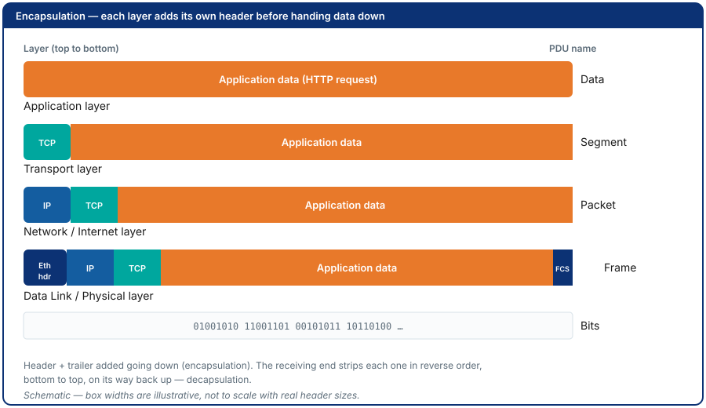
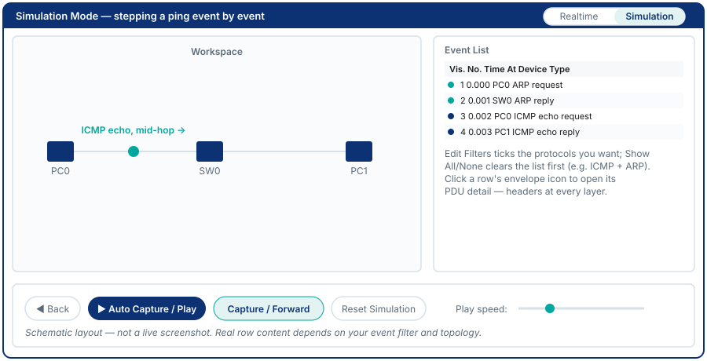
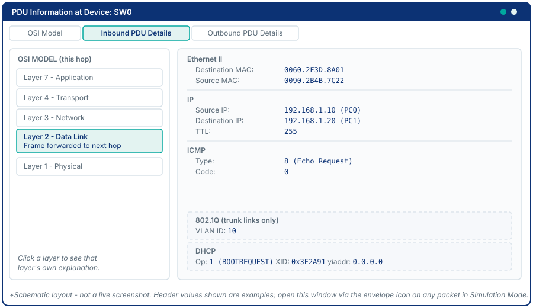

# Module 2 - Network Review 1 & Packet Tracer Intro

## Why This Matters

When a junior engineer says "the network is down," what do they mean? Usually it means one application on one machine stopped working. But is the problem at Layer 1 (is the cable plugged in?), Layer 3 (is the **IP** - Internet Protocol - address wrong?), Layer 4 (is the port blocked?), or Layer 7 (is the web server down)? The **OSI** (Open Systems Interconnection) and **TCP/IP** (Transmission Control Protocol / Internet Protocol) models exist not as textbook abstractions but as a **diagnostic checklist**: if you can ping by IP address but not by name, the problem is at the **DNS** (Domain Name System - the service that turns names into IP addresses) layer, not IP. If you can't ping at all, check lower. This systematic, layer-by-layer thinking is what separates engineers who fix problems from ones who guess. This module makes that thinking concrete by letting you **watch packets move layer by layer** in Packet Tracer's Simulation Mode.

## Learning Outcomes

By the end of this lab, students are able to:

1. Describe the function of each OSI layer and map it to the corresponding TCP/IP layer.
2. Use Packet Tracer Simulation Mode to observe protocol encapsulation and decapsulation.
3. Identify which protocols operate at which layers using packet capture in Packet Tracer.
4. Trace a complete **HTTP** (HyperText Transfer Protocol) request from browser to server, naming each protocol envelope added and removed at each hop.

## Pre-Lab

**Read before class:** Reference module 2, any Packet Tracer guide from Cisco NetAcad.

**Answer before the session:**

1. List the seven OSI layers (number and name) from top to bottom.
2. Which two OSI layers does the TCP/IP Application layer correspond to?
3. What is encapsulation? Describe it in one sentence without using the word "wrap."
4. A frame is received by a switch. Does the switch look at the IP header? Why or why not?
5. What is the PDU (Protocol Data Unit - the name for a chunk of data at a given layer) at each layer (bit, frame, packet, segment, data/message)?

## Equipment & Materials

- Cisco Packet Tracer 9.x
- Your own machine (for the optional Wireshark companion task)
- Wireshark (optional, free download from [wireshark.org](https://www.wireshark.org))

## Estimated Time (In-Class Lab, ~2 hrs)

| Phase | Time |
|-------|------|
| Part A: OSI review topology | 25 min |
| Part B: Simulation Mode - ICMP | 25 min |
| Part C: Simulation Mode - HTTP | 25 min |
| Part D: ARP cause and effect | 15 min |
| Challenge / wrap-up | 10 min |

*Guided Lab activities above run about 90 minutes - the rest of the 2-hour block covers troubleshooting, Challenge Tasks, and lab-report writeup.*

## Theory Review

The **OSI model** has 7 layers; the **TCP/IP model** has 4. Each layer adds a **header** (and sometimes a trailer) to the data handed down from above - this is **encapsulation**. At the receiving end, each layer strips its header and passes the remainder up - **decapsulation**.



| OSI | TCP/IP | PDU | Key Protocols |
|-----|--------|-----|---------------|
| Application (7) | Application | Data | HTTP, DNS, SMTP, FTP, Telnet |
| Presentation (6) | Application | Data | TLS/SSL, JPEG, ASCII |
| Session (5) | Application | Data | NetBIOS, RPC |
| Transport (4) | Transport | Segment | TCP, UDP |
| Network (3) | Internet | Packet | IP, ICMP, ARP |
| Data Link (2) | Network Access | Frame | Ethernet, PPP, Wi-Fi |
| Physical (1) | Network Access | Bit | Cables, signals, NIC |

> Full names, once: **HTTP** = HyperText Transfer Protocol; **DNS** = Domain Name System; **SMTP** = Simple Mail Transfer Protocol; **FTP** = File Transfer Protocol; **Telnet** = teletype network (a remote-terminal protocol); **TLS/SSL** = Transport Layer Security / Secure Sockets Layer; **JPEG** = Joint Photographic Experts Group (an image format); **ASCII** = American Standard Code for Information Interchange (a text encoding); **NetBIOS** = Network Basic Input/Output System; **RPC** = Remote Procedure Call; **TCP** = Transmission Control Protocol; **UDP** = User Datagram Protocol; **IP** = Internet Protocol; **ICMP** = Internet Control Message Protocol; **ARP** = Address Resolution Protocol; **PPP** = Point-to-Point Protocol (covered in Module 10).

> **NIC** = Network Interface Card, the hardware a device's IP address is bound to - what "PC0's interface" refers to in the addressing table below.

A **switch** operates at Layer 2: it reads the destination **MAC** (Media Access Control) **address** - the interface's burned-in hardware address - in the Ethernet frame and forwards it to the correct port - it never looks at the IP header. A **router** operates at Layer 3: it strips the Ethernet frame, reads the IP destination, makes a routing decision, and re-encapsulates into a new Ethernet frame for the next hop. Understanding this explains why routing is needed between subnets but not within them.

This is the mechanism that makes layer-by-layer troubleshooting possible: each device is only responsible for its own layer.

## Guided Lab

### Part A - Build the Review Topology

Construct the following two-LAN topology (two subnets joined by one router). Use the exact IP addresses shown - you will need them for later modules.

```mermaid
architecture-beta
    group lan1(net:cloud)[LAN 1]
    group lan2(net:cloud)[LAN 2]

    service pc0(net:pc)[PC0] in lan1
    service pc1(net:pc)[PC1] in lan1
    service srv0(net:server)[Server0] in lan1
    service sw0(net:switch)[Switch0] in lan1
    service r0(net:router)[Router0]
    service sw1(net:switch)[Switch1] in lan2
    service pc2(net:pc)[PC2] in lan2

    pc0:B -- T:sw0
    pc1:T -- B:sw0
    srv0:R -- L:sw0
    sw0:R -- L:r0
    r0:R -- L:sw1
    sw1:R -- L:pc2
```



**Device checklist** - seven devices total, place each one and rename it to match (click the label under its icon, or its **Config** tab's **Display Name** field):

| # | Device name | PT model | Where in the palette | LAN |
|---|------------|----------|-----------------------|-----|
| 1 | PC0 | PC-PT | End Devices → PC-PT | LAN 1 |
| 2 | PC1 | PC-PT | End Devices → PC-PT | LAN 1 |
| 3 | Server0 | Server-PT | End Devices → Server-PT | LAN 1 |
| 4 | Switch0 | Cisco 2960 | Network Devices → Switches → 2960 | LAN 1 |
| 5 | Switch1 | Cisco 2960 | Network Devices → Switches → 2960 | LAN 2 |
| 6 | PC2 | PC-PT | End Devices → PC-PT | LAN 2 |
| 7 | Router0 | Cisco 1841 (or 2811) | Network Devices → Routers → 1841 | joins both |

**Cabling** - all links use **Copper Straight-Through** (every link here connects unlike devices: PC/server to switch, or switch to router):

| From (device : port) | To (device : port) |
|-----------------------|----------------------|
| PC0 : FastEthernet0 | Switch0 : Fa0/1 |
| PC1 : FastEthernet0 | Switch0 : Fa0/2 |
| Server0 : FastEthernet0 | Switch0 : Fa0/3 |
| Switch0 : Fa0/24 | Router0 : Fa0/0 |
| Switch1 : Fa0/24 | Router0 : Fa0/1 |
| PC2 : FastEthernet0 | Switch1 : Fa0/1 |

Packet Tracer asks which interface to use when you click each device to cable it - match the port column above, don't accept the first option offered.

**Device addressing:**

| Device | Interface | IP Address | Subnet Mask | Gateway |
|--------|-----------|------------|-------------|---------|
| PC0 | NIC | 192.168.1.10 | 255.255.255.0 | 192.168.1.1 |
| PC1 | NIC | 192.168.1.20 | 255.255.255.0 | 192.168.1.1 |
| Server0 | NIC | 192.168.1.100 | 255.255.255.0 | 192.168.1.1 |
| Router0 | Fa0/0 | 192.168.1.1 | 255.255.255.0 | - |
| Router0 | Fa0/1 | 192.168.2.1 | 255.255.255.0 | - |
| PC2 | NIC | 192.168.2.10 | 255.255.255.0 | 192.168.2.1 |

> **Fa0/0** = FastEthernet0/0, the router's first FastEthernet interface - Cisco's interface-naming shorthand (type + slot/port). This abbreviated form recurs in every addressing table from here on. **LAN 1** / **LAN 2** in the diagram above are each a Local Area Network - a network confined to one side of the router.

> **Note:** The router interfaces come alive in **Module 4** - Module 3 first secures the router before its interfaces are ever turned on. For now, PCs (and the server) on the **same switch** should be able to ping each other; cross-router pings will fail - and that is expected and intentional.

**Step 1. Build LAN 1.** Place rows 1-4 of the device checklist (PC0, PC1, Server0, Switch0) and rename each. Cable the first three rows of the cabling table (PC0, PC1, and Server0 into Switch0). Then configure **PC0, PC1, and Server0**: click each device, open the **Desktop** tab, choose **IP Configuration**, select **Static**, and enter the IP address, subnet mask, and default gateway from the addressing table above (same procedure as Module 1, Step 16). Enter the gateway now even though the router isn't configured yet - it does nothing today, but Module 4 brings it to life.

**Step 2. Build LAN 2.** Place rows 5-6 (Switch1, PC2) and rename each. Cable the last row of the cabling table (PC2 into Switch1). Configure PC2's static IP the same way as Step 1.

**Step 3. Join the two LANs with Router0.** Place row 7 (Router0) and rename it. Cable the two switch-to-router rows: **Switch0 Fa0/24 to Router0 Fa0/0**, and **Switch1 Fa0/24 to Router0 Fa0/1** - the addressing table above binds each router interface to its LAN, and Module 4 builds on exactly this cabling.

> **Both new links show a red dot at the router end - that is expected, not a cabling mistake.** Module 1 taught you red = failed connection, but here it means something different: router interfaces are administratively shut down until you enable them in Module 4. The switch end will show green (the switch port itself is up); only the router end stays red until then.

📸 Screenshot the complete topology (all seven devices labeled, cabled, and visible).

**Step 4. Verify each LAN separately.** From PC0, open **Desktop → Command Prompt** and run `ping 192.168.1.20` to reach PC1 (same-LAN, should succeed). PC2 has no same-LAN neighbor to ping yet - its connectivity check is the cross-router Observe prompt below, which is expected to fail for now.

📸 Screenshot the successful same-subnet ping.

> **Observe:** Does the ping from PC0 to PC2 (192.168.2.10) succeed? Why not? What is missing? (Optional: try pinging Server0 at 192.168.1.100 too - same-LAN, so it should succeed the same way.)

---

### Part B - ICMP in Simulation Mode



**Step 5.** Switch to the **Simulation** tab in the bottom-right corner (or press Shift+S). In the Simulation Panel, under Event List Filters, click **Show All/None** to clear everything, then **Edit Filters** and tick only **ICMP** and **ARP** (IPv4 tab).

**Step 6.** PC0's ARP cache already has PC1's MAC cached from Step 4's ping - clear it first so the broadcast happens again: `PC0> arp -d`. Then send a single ping to PC1: `ping -n 1 192.168.1.20` (Packet Tracer syntax - the option comes *before* the target).

**Step 7.** Click **Capture/Forward** to advance one event at a time (or **Auto Capture/Play** to let it run automatically; the speed slider controls the pace). Watch each event appear in the Event List.

📸 Screenshot the event list showing the ARP request/reply followed by ICMP echo/reply - annotate which two rows are ARP and which two are ICMP.

> **Observe:** Which happened first - ARP or ICMP? Why must ARP happen first?

**Step 8.** Click on any ICMP event's **colored square in the Event List's Info column** to open its PDU information (the envelope icon is the packet graphic on the workspace canvas, not the Event List row). Identify:

- Source and destination MAC (Layer 2)
- Source and destination IP (Layer 3)
- ICMP type and code (Layer 3 / ICMP)



> **Explain:** At which layers does the switch read headers? At which layers does the PC's NIC read headers? Based on the Theory Review, what would a **router** read if this packet ever crossed one? The router in this topology is still inactive, so you can't verify this hands-on yet - Module 4 lets you check your answer directly.

---

### Part C - HTTP in Simulation Mode

**Step 9.** Server0 already exists and is addressed from Part A - it just isn't serving anything yet. Click Server0 → **Services** tab → **HTTP** → verify it is **On**.

**Step 10.** Switch back to **Realtime mode** first (same toggle as Step 5, bottom-right corner) - a normal page load needs Realtime, not Simulation. On PC0, open **Desktop → Web Browser**. In the **URL** (Uniform Resource Locator - the address-bar text) bar type: `http://192.168.1.100`

The page **loads** - PC0 and Server0 share LAN 1, so no router is involved yet.

📸 Screenshot the loaded page.

**Step 11.** Switch back to **Simulation mode**. Step 10's page load already cached Server0's MAC, so clear it first: `PC0> arp -d`. Click **Show All/None** then **Edit Filters** and tick **ARP** (IPv4 tab) and **TCP, HTTP** (Misc tab). Send the HTTP request again from PC0.

> **No DNS events will appear:** you typed a raw IP address, so nothing needs name resolution. DNS enters the story once a name server joins a topology in a later module.

📸 Screenshot the event list showing the sequence of protocols involved.

> **List in order** the protocol events you observe - e.g. an ARP request and reply; then the **TCP** three-way handshake: **SYN** (the "synchronize" flag that opens a connection), SYN-ACK, ACK; then the **HTTP GET** (the request that asks for the page) and the response carrying it. For each, state which layer it belongs to.

**Step 12.** Now try the same thing from across the router: on **PC2**, open **Desktop → Web Browser** and request `http://192.168.1.100`. It fails. In Simulation Mode, watch why: PC2 sees the server is on a different network, so it ARPs for its own gateway `192.168.2.1` - and nothing answers, because Router0 is not yet configured. The request never leaves LAN 2.

> This is the exact wall Modules 3-4 tear down: Module 3 secures the router, Module 4 brings its interfaces up.

---

### Part D - ARP Cause and Effect

This exercise demonstrates why ARP must precede any IP communication - and why running the same command twice can give different output.

**Step 13.** Switch back to **Realtime mode**. PC0's ARP cache likely still holds an entry from an earlier step (Part B's PC1 ping, or Part C's Server0 request) - clear it first so this comparison starts from a genuinely empty cache: `PC0> arp -d`. Then check:

```
PC0> arp -a
```

📸 Screenshot. The table should now be empty (no entry for PC1's IP).

**Step 14.** Ping PC1 once:

```
PC0> ping -n 1 192.168.1.20
```

**Step 15.** Run `arp -a` again immediately:

```
PC0> arp -a
```

📸 Screenshot. You should now see an entry for 192.168.1.20 with a MAC address.

> **Answer this question:** You ran `arp -a` twice with no configuration change in between. Why did the two outputs differ?
> *(Hint: the ping in Step 14 triggered an ARP broadcast - your PC had to discover PC1's MAC before it could send the ICMP Echo Request. Once ARP received a reply, it cached the MAC. The second `arp -a` shows that cached entry.)*

**Step 16.** Switch to **Simulation mode**. That cached entry means a fresh ping won't ARP again - clear it first so the broadcast happens again: `PC0> arp -d`. Filter for **ARP and ICMP only** and send the same ping. Step through the events, then click the ARP request's PDU details to see the broadcast destination.

📸 Screenshot of the ARP event's PDU details showing the broadcast destination (Ethernet destination FF:FF:FF:FF:FF:FF), plus the Event List showing the ARP reply (unicast) followed by the ICMP Echo Request.

> **Observe:** ARP is a Layer 2 broadcast frame, even though the Theory Review table above groups the *protocol* ARP at Layer 3 (it resolves a Layer-3 IP into a Layer-2 MAC, so it's conventionally listed there) - the broadcast itself is what happens at Layer 2. Every device on the local segment receives it. Only the device that owns the target IP replies. This is why ARP works within a subnet but cannot cross a router (routers do not forward broadcasts).

**Step 17.** Save your work: **File → Save As** → `StudentID_Module2.pka`.

---

## Challenge Tasks

1. **Wireshark companion (real machine):** Open Wireshark, start a capture on your active interface, then open a webpage in your browser. Stop the capture and find: (a) the **DNS** (Domain Name System) query/response, (b) the TCP three-way handshake, (c) the HTTP GET request. Screenshot all three and annotate the layer for each.
2. Open the PDU details of the HTTP GET event at both PC0 and Server0. Compare the Layer 2 (MAC) and Layer 3 (IP) addresses in each. What stays the same between the two, and what would you expect to change if a router sat between them? (Preview - Module 4 lets you verify this directly.)
3. **Predict, then verify:** before running it, predict which devices on LAN 1 will receive the ARP broadcast when you run `arp -d` followed by a ping to Server0, and which one will reply. Run it in Simulation Mode and check your prediction. Why does PC1 stay silent even though it receives the broadcast too?

> Looking for the router-MAC-rewrite task or the second-router task from earlier drafts of this lab? They now live in [Module 4](module-04.md) and [Module 5](module-05.md) - the router needs live interfaces first. The personalized subnetting drill moved to [Module 3](module-03.md)'s Part A (Simulation Alt).

## Deliverables

1. Screenshot of the complete topology in Packet Tracer (all devices labeled and visible).
2. Screenshot of the successful PC0-to-PC1 ping, annotated with the PDU name at Layer 2 and Layer 3.
3. Screenshot of the Simulation Mode event list showing ARP followed by ICMP.
4. Written explanation of why ARP must precede ICMP (reference MAC vs IP resolution).
5. Screenshot of the HTTP simulation event list.
6. Written ordered list of protocols observed in the HTTP sequence with their OSI layer, plus one sentence on why PC2's attempt at the same URL fails.
7. Written answer: what is the difference between what a switch reads vs. what a router reads in a received packet?
8. Part D - two `arp -a` screenshots (before and after ping) with written explanation of why the outputs differ.
9. Your saved `.pkt` file.

## Assessment Rubric

| Criterion | Points |
|-----------|--------|
| Topology correctly built (all seven devices, addressed per the table) | 20 |
| ARP/ICMP simulation screenshots with annotation | 20 |
| HTTP protocol sequence correctly ordered and layered | 20 |
| Switch vs. router layer-reading explanation | 15 |
| ARP cause-and-effect (before/after arp -a with explanation) | 15 |
| Challenge Task (any one, with explanation) | 10 |
| **Total** | **100** |
