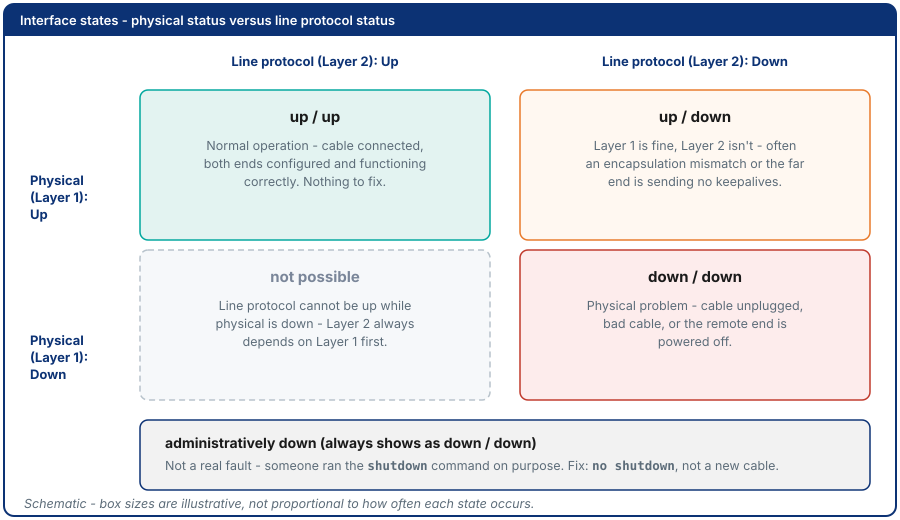
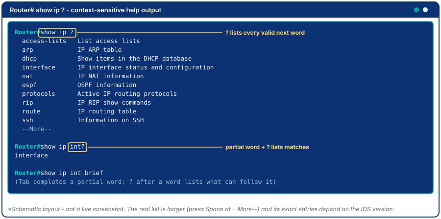
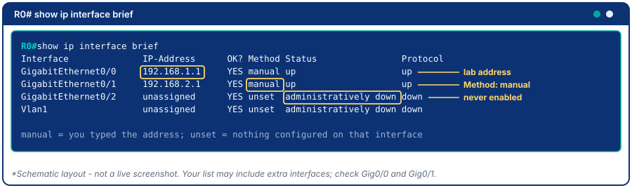
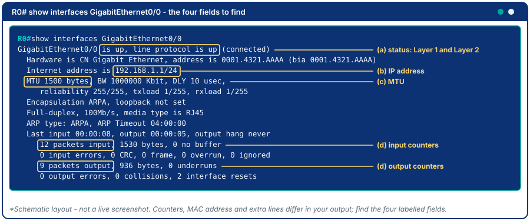
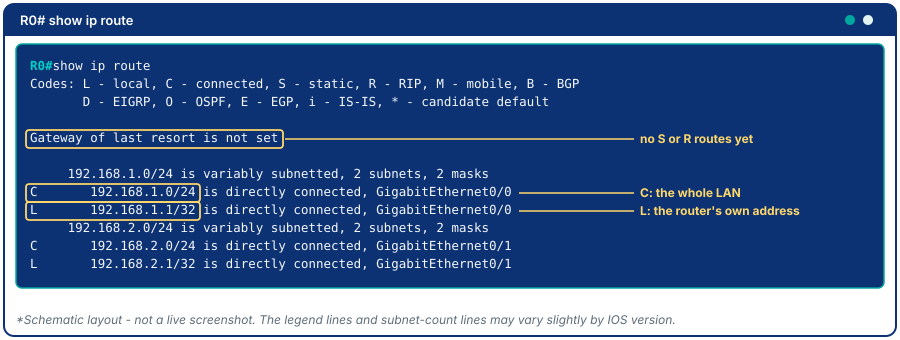
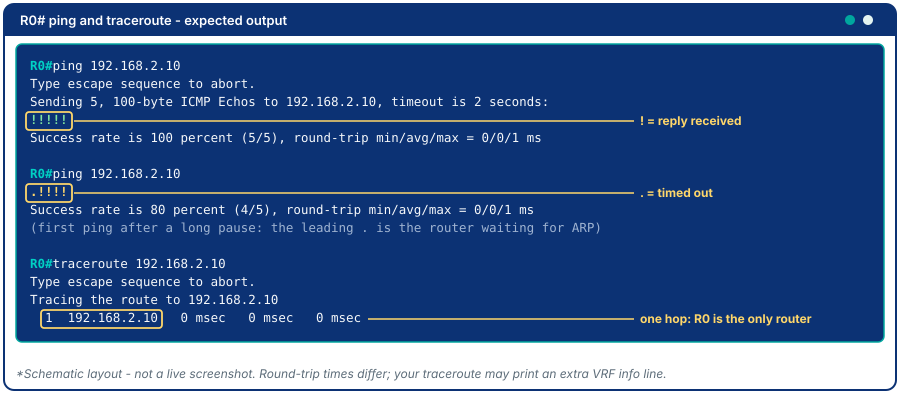
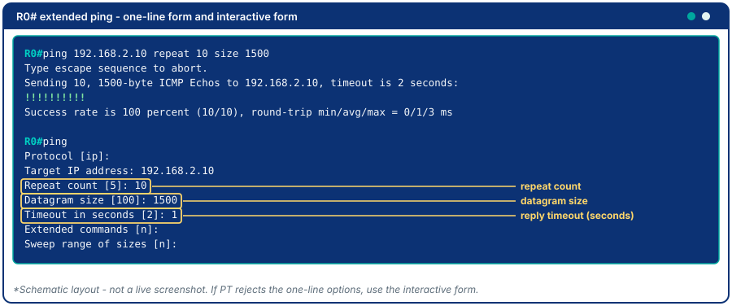
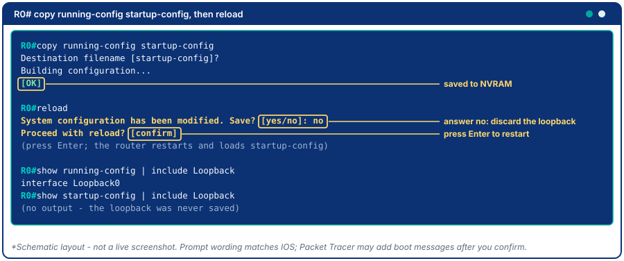

# Module 4 - IOS Management Commands

## Why This Matters

Imagine you are called at midnight because a branch office cannot reach headquarters. You log into the router remotely. The running configuration in RAM looks fine - but something is clearly wrong. Is the interface down? Is there a duplicate IP? Did someone accidentally apply an ACL? Is the routing table missing a route? IOS `show` commands are the MRI scan of a Cisco router: they reveal the live internal state of every subsystem in seconds. Engineers who memorize the ten most important `show` commands - and know how to interpret their output - diagnose and fix problems that stumped everyone else. This module makes those commands automatic.

## Learning Outcomes

By the end of this lab, students are able to:

1. Use the `?` (context-sensitive help) system to discover and confirm commands without memorization.
2. Execute key `show` commands and interpret their output: `show version`, `show interfaces`, `show ip interface brief`, `show running-config`, `show startup-config`, `show ip route`, `show arp`, `show cdp neighbors`.
3. Configure all interfaces (IP address, `no shutdown`) and verify them.
4. Use `ping` (including its extended options) and `traceroute` from the router to test reachability and read the result symbols.
5. Back up a running configuration to NVRAM and explain the RAM/NVRAM distinction.
6. Compare running-config versus startup-config and explain the implications of each.

## Pre-Lab

**Read before class:** Reference module - Modul Praktikum 16 (Modul Praktikum 16 - Konfigurasi Dasar Router Cisco), focusing on the `show` commands section and the RAM/NVRAM explanation.

**Answer before the session:**

1. A router has 256 MB of DRAM and 64 MB of Flash. Which one stores the IOS image? Which one stores the running-config?
2. What does `show ip interface brief` show that `show interfaces` does not (and vice versa)?
3. An interface shows `GigabitEthernet0/0 is down, line protocol is down`. What are two possible physical causes?
4. An interface shows `GigabitEthernet0/0 is up, line protocol is down`. What does this suggest about Layer 1 vs Layer 2?
5. What is the effect of running `erase startup-config` followed by `reload`?

## Equipment & Materials

- Cisco Packet Tracer 9.x
- No file from an earlier module is needed: this lab is **self-contained** and you build its topology fresh in the Setup below.

## Estimated Time (In-Class Lab, ~2 hrs)

| Phase | Time |
|-------|------|
| Setup: build the topology and address the PCs | 15 min |
| Part A: Context-sensitive help | 10 min |
| Part B: Interface configuration | 15 min |
| Part C: show command deep-dive | 25 min |
| Part D: Ping and traceroute as diagnostic tools | 15 min |
| Part E: Config backup and comparison | 15 min |

*Guided Lab activities above run about 95 minutes - the rest of the 2-hour block covers troubleshooting, Challenge Tasks, and lab-report writeup.*

## Theory Review

### Interface States

Every Cisco interface has two state indicators, visible in `show interfaces`:

```
GigabitEthernet0/0 is up, line protocol is up
```

- **First status (up/down/administratively down):** Physical layer - is there a cable/signal?
  - `administratively down`: explicitly shut down with the `shutdown` command (fix: `no shutdown`)
  - `down`: no physical signal (cable unplugged, other end off)
- **Second status (up/down):** Data Link layer - is the keepalive/protocol working?
  - If L1 is down, L2 is always down too
  - L1 up but L2 down: often an encapsulation mismatch (important for serial/WAN links)



### The ? System

Cisco IOS has full context-sensitive help. At any point:

```
Router# sh?                 (lists commands starting with "sh")
Router# show ?              (lists all show subcommands)
Router# show ip ?           (lists all "show ip" options)
Router# show ip int brief   (Tab completion works too)
```

You never need to memorize the full command; use `?` to discover it.

### Key show Commands

| Command | What it reveals |
|---------|----------------|
| `show version` | IOS version, uptime, memory, hardware |
| `show interfaces` | Per-interface: state, IP, counters, errors |
| `show ip interface brief` | Compact table: all interfaces, IP, state |
| `show running-config` | Current live config (in RAM) |
| `show startup-config` | Saved config (in NVRAM) - what loads on reboot |
| `show ip route` | Routing table: all known networks and how to reach them |
| `show arp` | ARP cache: IP-to-MAC mappings the router has learned |
| `show cdp neighbors` | Directly connected Cisco devices (Cisco Discovery Protocol) |

## Guided Lab

### Before you start

**Build fresh.** This lab is self-contained - you do not need any file from Modules 2 or 3. Open a new Packet Tracer file (**File → New**). Your router starts **factory-fresh**: no hostname, no passwords, all interfaces shut down. Module 3's hardening is not present here, and that is intentional, so every command in this lab starts from the same known state.


**Device checklist** - five devices, place each one and rename it (click the label under its icon, or use the **Config** tab's **Display Name** field):

| # | Device name | PT model | Where in the palette | LAN |
|---|------------|----------|-----------------------|-----|
| 1 | PC0 | PC-PT | End Devices → PC-PT | LAN 1 |
| 2 | SW0 | Cisco 2960 | Network Devices → Switches → 2960 | LAN 1 |
| 3 | R0 | Cisco 2911 | Network Devices → Routers → 2911 | joins both |
| 4 | SW1 | Cisco 2960 | Network Devices → Switches → 2960 | LAN 2 |
| 5 | PC1 | PC-PT | End Devices → PC-PT | LAN 2 |

**Cabling** - every link connects unlike devices (PC to switch, switch to router), so all use **Copper Straight-Through**:

| From (device : port) | To (device : port) | Cable |
|-----------------------|----------------------|-------|
| PC0 : FastEthernet0 | SW0 : Fa0/1 | Copper Straight-Through |
| SW0 : Fa0/24 | R0 : GigabitEthernet0/0 | Copper Straight-Through |
| SW1 : Fa0/24 | R0 : GigabitEthernet0/1 | Copper Straight-Through |
| PC1 : FastEthernet0 | SW1 : Fa0/1 | Copper Straight-Through |

> **Port names:** the 2911 router's onboard ports are **GigabitEthernet0/0**, **0/1**, **0/2** (short form **Gig0/0**, **Gi0/0**). The 2960 switch ports stay **FastEthernet** (Fa0/x). A PC's port is called FastEthernet0. Packet Tracer asks which interface to use when you click each device to cable it - match the port column above.

**Addressing table** (every device, including the PCs):

| Device | Interface | IP Address | Subnet Mask | Default Gateway |
|--------|-----------|------------|-------------|-----------------|
| PC0 | FastEthernet0 | 192.168.1.10 | 255.255.255.0 | 192.168.1.1 |
| R0 | Gig0/0 | 192.168.1.1 | 255.255.255.0 | - |
| R0 | Gig0/1 | 192.168.2.1 | 255.255.255.0 | - |
| PC1 | FastEthernet0 | 192.168.2.10 | 255.255.255.0 | 192.168.2.1 |
| SW0, SW1 | - | - | - | Layer-2 only, no IP |

### Setup - Build the Topology and Address the PCs

**Step 1.** Place the five devices from the checklist, rename them, and make the four cable connections from the cabling table.

**Step 2.** Configure each PC: click it → **Desktop** tab → **IP Configuration** → choose **Static** and enter the values from the addressing table.


> **What you should see:** the PC links to the switches show green at the PC end and amber at the switch end for about 30 seconds (the switch's Spanning Tree Protocol is checking the port), then green. The two router-end link lights stay **red** - the router interfaces are shut down, which is exactly what Part B fixes.

📸 Screenshot the complete topology with all five devices labeled and cabled.

---

### Part A - Context-Sensitive Help

**Step 3.** Double-click **R0** → **CLI** tab. If Packet Tracer asks `Would you like to enter the initial configuration dialog? [yes/no]:`, type `no` and press Enter, then press Enter again at `Press RETURN to get started!`.


You should see the User EXEC prompt `Router>`. The ladder below shows how the prompt changes with each mode; keep it in view, because every command block in this lab states the mode it starts from.


**Step 4.** Practice the `?` system at each mode level (start in User EXEC, then enter Privileged EXEC):

```
Router> ?
Router> en?
Router> enable
Router# show ?
Router# show ip ?
Router# show ip int?
```



> **What you should see:** each `?` prints a list of valid next words (press Space at `--More--` for the next page); `show ip int?` prints `interface`. Note that `Router>` offers far fewer commands than `Router#`.

📸 Screenshot two of these `?` outputs.

> **Observe:** How many commands begin with `show ip i`? Type `show ip i` and press `?` to discover them. This is how professionals use IOS in the field - not from memory.

---

### Part B - Interface Configuration

**Step 5.** Set the router's name and configure both interfaces. Start from `Router>` (User EXEC) and move up one mode at a time:

```
Router> enable
Router# configure terminal
Router(config)# hostname R0
R0(config)# interface GigabitEthernet0/0
R0(config-if)# ip address 192.168.1.1 255.255.255.0
R0(config-if)# no shutdown
R0(config-if)# description LAN1-to-SW0
R0(config-if)# exit
R0(config)# interface GigabitEthernet0/1
R0(config-if)# ip address 192.168.2.1 255.255.255.0
R0(config-if)# no shutdown
R0(config-if)# description LAN2-to-SW1
R0(config-if)# end
R0#
```

> **Mode switches in this block:** `enable` moves User EXEC to Privileged EXEC; `configure terminal` enters Global Config; `interface ...` enters Interface Config; `exit` goes back one level to Global Config; `end` jumps straight back to Privileged EXEC. The prompt changes to `R0` right after `hostname R0`. Use `end` (not `exit`) when you want to run `show` commands again.

> **Observe:** After each `no shutdown`, IOS prints `%LINK-5-CHANGED` and `%LINEPROTO-5-UPDOWN` messages saying the interface changed state to up. In the topology workspace, the router-end link light changes from red to green (Layer 1 coming up); the switch-end light may stay amber for about 30 seconds while STP checks the port, then turn green. Wait for green before testing.


**Step 6.** Verify from the PCs before using the `show` commands: on PC0 open **Desktop → Command Prompt** and run `ping 192.168.1.1` (the router's LAN 1 address). Repeat from PC1 with `ping 192.168.2.1`.

> **What you should see:** the first ping may show one `Request timed out` (ARP resolving the router's MAC), then `Reply from 192.168.1.1` for the rest.

📸 Screenshot the topology with both router-end link lights green.

---

### Part C - The show Command Deep-Dive

Run each command from Privileged EXEC (`R0#`). If your prompt shows `R0(config)#` or `R0(config-if)#`, type `end` first.

**Step 7.** Show the compact interface table:

```
R0# show ip interface brief
```



📸 Screenshot.
> **What you should see:** Gig0/0 and Gig0/1 with their addresses, `YES manual`, `up`, `up`; any other interface `administratively down`.
> **Observe:** What does the `Method` column show? What does "manual" vs "unset" mean?

**Step 8.** Show the full detail for one interface:

```
R0# show interfaces GigabitEthernet0/0
```



📸 Screenshot.
> **Identify:** Find and annotate: (a) the line/protocol status, (b) the IP address, (c) the MTU (Maximum Transmission Unit - the largest packet size the interface forwards without fragmenting it), (d) the input/output packet counters.

**Step 9.** Show the hardware and software summary:

```
R0# show version
```

> **Record:** IOS version, router model (2911), available DRAM, Flash size. You will use this in your lab report.

**Step 10.** Show the ARP cache (IP-to-MAC mappings):

```
R0# show arp
```

> **Observe:** The table is **not empty**: the router lists its own interface addresses (192.168.1.1 and 192.168.2.1) with an age of `-`, meaning "this is my own address, it never expires". If you pinged the router in Step 6, it also lists the PCs it has heard from, with an age in minutes. Clear the learned entries with `clear arp-cache`, run `show arp` again, then ping `192.168.1.1` from PC0 and run `show arp` a third time. What changed? (If `clear arp-cache` is not accepted in your PT build, skip it and compare against your Step 6 output.)

**Step 11.** Show the routing table:

```
R0# show ip route
```



📸 Screenshot.
> **What you should see:** two `C` lines (192.168.1.0/24 and 192.168.2.0/24) and two `L` lines (192.168.1.1/32 and 192.168.2.1/32), nothing else.
> **Identify:** What does the `C` prefix mean? What does the `L` prefix mean? Are there any routes with `S` (static) or `R` (RIP) prefixes? Why not?

**Step 12.** Show directly connected Cisco neighbors:

```
R0# show cdp neighbors
```

> **List:** Which directly connected Cisco devices does the router see? What port are they connected to? (Expect SW0 on Gig0/0 and SW1 on Gig0/1; the PCs do not appear because they are not Cisco devices running CDP. CDP advertisements can take up to a minute to arrive.)

---

### Part D - Ping and Traceroute as Diagnostic Tools

Good network engineers don't just use `ping` with its defaults - they know which options reveal specific failure modes. IOS `ping` and `traceroute` both support extended options that provide far more diagnostic information. Run these from `R0#` (Privileged EXEC).

**Step 13.** Run a basic ping from the router to PC1:

```
R0# ping 192.168.2.10
```

> The default sends 5 ICMP Echo Requests with a 2-second timeout and 100-byte datagram size.



> **What you should see:** `!!!!!` and `Success rate is 100 percent (5/5)`. If the router has not talked to PC1 for a while, the first symbol may be `.` (ARP resolving) and the rate 80 percent. Run it again and it will be 100 percent.

**Step 14.** Run an extended ping. One-line form first:

```
R0# ping 192.168.2.10 repeat 10 size 1500
```

Then the interactive form: type `ping` alone, press Enter, and answer each prompt (press Enter to accept the value in brackets):

```
R0# ping
Protocol [ip]:
Target IP address: 192.168.2.10
Repeat count [5]: 10
Datagram size [100]: 1500
Timeout in seconds [2]: 1
Extended commands [n]:
Sweep range of sizes [n]:
```



> **Note - verify in PT 9:** the one-line `repeat` and `size` keywords are standard IOS; if Packet Tracer rejects them, the interactive form above always works.

📸 Screenshot. Identify: which option controls the number of probes? Which controls how long to wait for a reply? What does a large `size` value test?

> **Failure interpretation:** IOS ping uses dots (`.`) for timeout and exclamation marks (`!`) for success. Common patterns:
> - `!!!!!` - full connectivity
> - `.....` - no reply at all; a missing route near the **source**, or a down link
> - `U....` - destination unreachable ICMP message received; a router on the path sent back a "no route to host" error
> - `!!!!.` - intermittent loss (congestion or flapping interface)

**Step 15.** Run traceroute from the router:

```
R0# traceroute 192.168.2.10
```

📸 Screenshot. Identify each hop (IP and round-trip time).

> **What you should see:** exactly **one hop**, the destination 192.168.2.10 itself. R0 is directly connected to LAN 2, so no other router lies in between. Traceroute becomes interesting from Module 5, when a second router is added.

> **How traceroute works:** IOS `traceroute` sends **UDP** probes to a high, unlikely-to-be-used port, starting with TTL=1, then TTL=2, and so on. Each router that decrements TTL to 0 sends back an **ICMP Time Exceeded** message, revealing its own IP. When a probe finally reaches the destination, the destination answers with an **ICMP Port Unreachable** (nothing listens on that UDP port), signaling the trace is complete. Windows `tracert` works the same way but sends **ICMP Echo** probes instead of UDP.

> **Timeout symbol:** Three asterisks `* * *` for a hop means no reply arrived for that hop - the router was configured to suppress ICMP messages, or a firewall blocked them. The trace continues past a silent hop; it does not mean the path is broken.

**Step 16.** Explore `traceroute` options - use `traceroute ?` to discover them. Try one option of your choice and document what it changes.

> ⚠️ **IOS vs Windows difference:** In IOS `traceroute`, timeout is in seconds. In Windows `tracert`, the `-w` flag is in **milliseconds** - `tracert -w 1000` means 1 second, not 1 ms. This is a common gotcha when switching between environments.

---

### Part E - Configuration Backup and Comparison

**Step 17.** Save the running configuration. Start from Privileged EXEC (`R0#`):

```
R0# copy running-config startup-config
Destination filename [startup-config]? [Enter]
```



📸 Screenshot.
> **What you should see:** `Building configuration...` then `[OK]`.

**Step 18.** Make a deliberate change - add a new loopback interface. From `R0#`:

```
R0# configure terminal
R0(config)# interface loopback 0
R0(config-if)# ip address 10.0.0.1 255.255.255.255
R0(config-if)# end
R0#
```

**Step 19.** Compare the two configs. The filter text is case-sensitive, so use a capital `L`:

```
R0# show running-config | include Loopback
R0# show startup-config | include Loopback
```

> **Observe:** Does the loopback appear in startup-config? Why not?

**Step 20.** Reload the router *without* saving. Type `reload`. IOS asks `System configuration has been modified. Save? [yes/no]:` - answer `no`. Then it asks `Proceed with reload? [confirm]` - press Enter. After the reboot (press Enter to get a prompt; log in with `enable` again) run:

```
R0# show ip interface brief
```

> **Explain:** What happened to the loopback interface? What happened to Gig0/0 and Gig0/1? Why did one survive the reboot and the other did not?

**Step 21.** Save your work: **File → Save As**, name the file `module04-ios-management.pkt`, and keep it for your deliverables.

---

## Challenge Tasks

1. Use `show interfaces` to find the number of input errors and output drops on an interface. If you were troubleshooting a slow network, what would a high input error count suggest? What would a high output drop count suggest?
2. Use `show running-config | section interface` to display only the interface sections of the config. Research the `|` (pipe) operator in IOS - what other filters are available? (`begin`, `include`, `exclude`, `section`)
3. Add a second router **R1** (Cisco 2911) and cable **R0 Gig0/2** to **R1 Gig0/0** with a **Copper Cross-Over** cable (router to router). Run `no shutdown` on both interfaces, then use `show cdp neighbors detail` on R0 to see R1's IOS version. Explain why CDP is useful for network inventory and why it is sometimes disabled in security-conscious networks.
4. **Ping flag scavenger hunt:** In IOS, run `ping ?` to see what the one-line form offers, and run the interactive `ping` to see its prompts. Find and test: the option that sets repeat count; the option that sets packet size; the option that sets timeout. For each option, document: the flag or prompt name, what it changes, and what scenario would make it useful for troubleshooting.
5. Both interfaces are `up/up`, so ping across the router: PC0 to PC1 (192.168.2.10) in Simulation Mode. First clear PC0's ARP cache with `arp -d` so the exchange is visible. Find the exact moment the Ethernet frame changes its **source and destination MAC address** as the packet passes through R0. Which MAC is used on each segment - before the router, and after? What does this confirm about how routers rebuild the Layer 2 header on every hop?

> **Looking ahead:** R0 can only route between the two networks it is directly attached to - the `C` and `L` lines in `show ip route` are all it knows. Add a second router with its own LAN behind it (as in Challenge 3) and R0 has no route to that LAN. Module 5 teaches static routes, which tell a router about networks it is not directly connected to.

## Deliverables

1. Two screenshots of the `?` context-help system with annotation of what each output means.
2. Screenshot of `show ip interface brief` with both interfaces `up/up` and the addresses from the addressing table.
3. Annotated screenshot of `show interfaces GigabitEthernet0/0` with line/protocol status, IP, MTU, and packet counters labeled.
4. Screenshot of `show ip route` with C and L prefixes explained.
5. Screenshot of `show arp` before and after ping, with explanation of what changed and why.
6. Part D - extended ping and traceroute screenshots with annotations of: (a) dot vs exclamation interpretation, (b) how traceroute uses TTL and ICMP Time Exceeded (and why you see one hop here), (c) the IOS-vs-Windows UDP/ICMP probe and `-w` units differences.
7. Written explanation of what happened to loopback vs. Gig0/0 after a reload-without-save, with reference to RAM vs. NVRAM.
8. Your saved `.pkt` file.

## Assessment Rubric

| Criterion | Points |
|-----------|--------|
| All required show commands executed and screenshots present | 25 |
| show ip interface brief: both interfaces up/up with the addressing table values | 15 |
| show interfaces annotated correctly (all four fields) | 15 |
| Extended ping and traceroute with correct interpretation | 25 |
| RAM/NVRAM reload explanation | 10 |
| Challenge Task (any one, with explanation) | 10 |
| **Total** | **100** |
