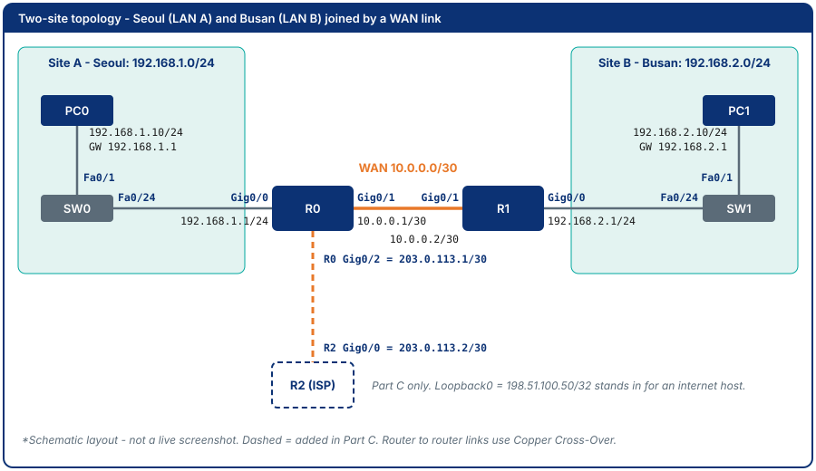
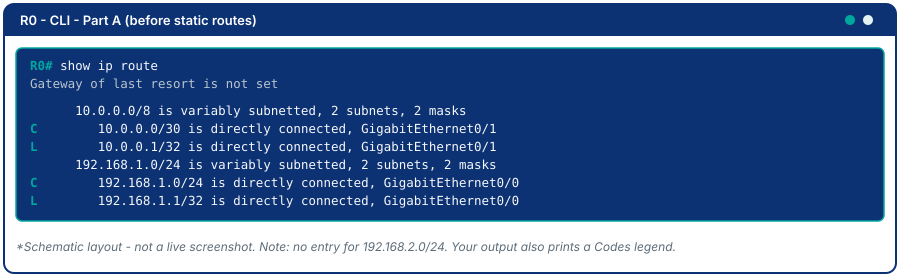
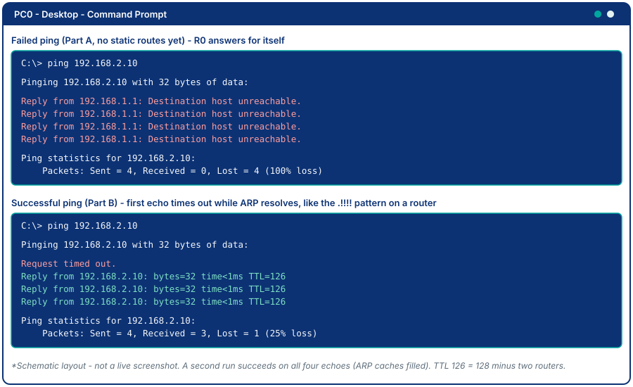
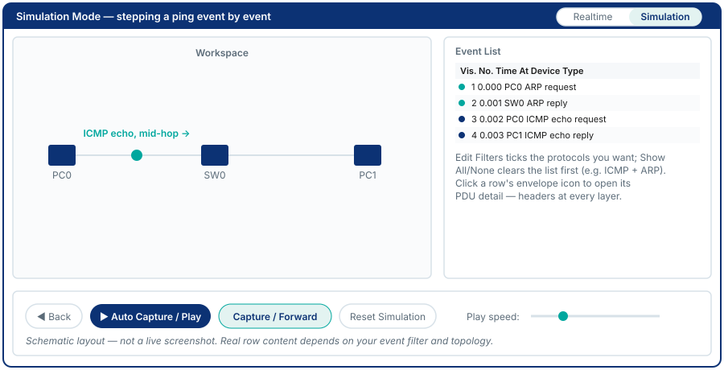
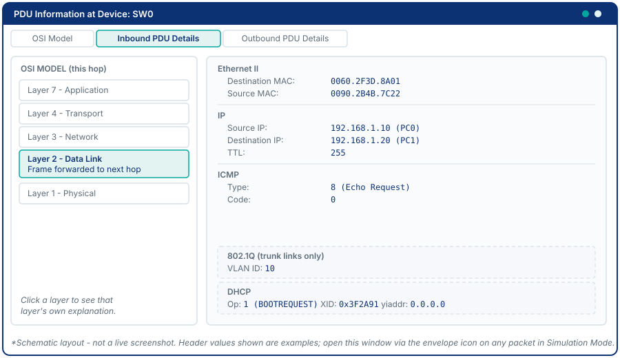
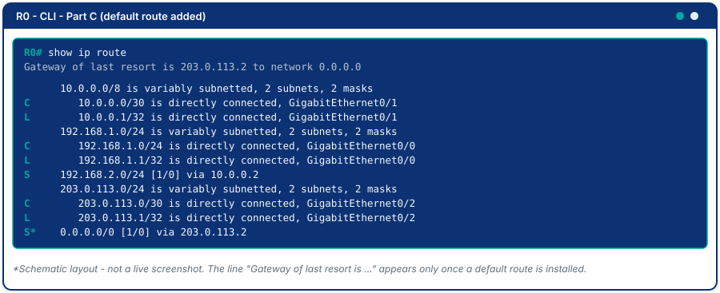
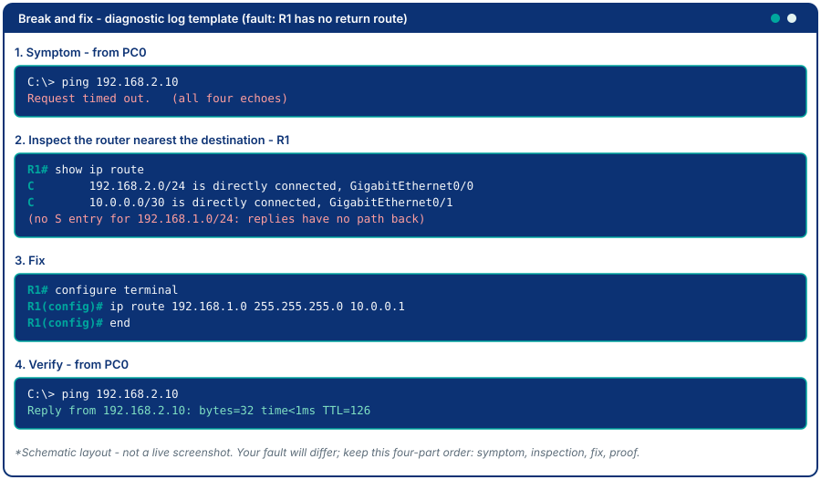

# Module 5 - Routing Fundamentals & Static Routing

## Why This Matters

Picture two branch offices - Office A in Seoul and Office B in Busan. Each has its own local network (192.168.1.0/24 and 192.168.2.0/24). Every PC can ping its own router, but no one in Seoul can ping anyone in Busan. Orders entered in Seoul never reach the warehouse system in Busan. Email between offices fails silently. Each office has its own router, and the two routers are joined by a link, but neither router *knows* that Busan-bound traffic should leave through its WAN interface - because nobody told it. This is precisely the problem static routing solves. A static route is an explicit instruction: "to reach 192.168.2.0/24, send traffic out this interface, toward this next-hop IP." Without it, packets die at the router. With it, both offices talk freely.

## Learning Outcomes

By the end of this lab, students are able to:

1. Explain how a router makes a forwarding decision using its routing table, including longest prefix match and administrative distance.
2. Configure static routes using both next-hop IP syntax and exit-interface syntax.
3. Configure a default route (gateway of last resort) and verify its use.
4. Use `show ip route` to verify routing table entries and identify connected, local, and static routes.
5. Diagnose and fix a broken inter-network connectivity scenario.

## Pre-Lab

**Read before class:** Reference module - Modul Teori Jarkom-5 (Lapisan Network), particularly the section on routing; Modul Praktikum 17, the two-router static routing lab.

**Answer before the session:**

1. What is a routing table? What types of entries can appear in it?
2. What does the `C` code mean in a routing table? What does `S` mean? What about `S*`?
3. What is the difference between these two static route commands?
   - `ip route 192.168.2.0 255.255.255.0 10.0.0.2`
   - `ip route 192.168.2.0 255.255.255.0 GigabitEthernet0/1`
4. What is a default route, and when is it used?
5. If a router has two static routes to the same destination with different subnet masks (e.g. /24 and /16), which one does it prefer? Why?
6. A router learns the same network from a static route and from RIP. Which one is installed in the routing table, and what number decides it?

## Equipment & Materials

- Cisco Packet Tracer 9.x
- Three Cisco 2911 routers (R0 and R1 from Part A; R2 joins in Part C), two Cisco 2960 switches, and two PCs (one per site)

## Estimated Time (In-Class Lab, ~2 hrs)

| Phase | Time |
|-------|------|
| Part A: Build the problem | 25 min |
| Part B: Add static routes | 30 min |
| Part C: Default route and longest prefix match | 35 min |
| Part D: Break and fix | 20 min |

*Guided Lab activities above run about 110 minutes - the rest of the 2-hour block covers Challenge Tasks and lab-report writeup. Skip the Challenge Tasks if Part C runs long.*

## Theory Review

### How a Router Decides Where to Send a Packet

When a packet arrives, the router:
1. Looks at the destination IP address.
2. Searches its **routing table** for the longest prefix match (most specific route).
3. Forwards out the matching interface (or to the next-hop IP).
4. If no match: uses the **default route** (`0.0.0.0/0`) if one exists; otherwise drops the packet.

**Longest prefix match:** A route for `192.168.1.0/26` beats a route for `192.168.1.0/24` for a packet destined to `192.168.1.50` - the /26 is more specific.

### Static Route Syntax

```
ip route <network> <mask> <next-hop-IP>
ip route <network> <mask> <exit-interface>
ip route 0.0.0.0 0.0.0.0 <next-hop-IP>      (default route)
```

- **Next-hop IP syntax** (recommended for multi-access networks like Ethernet): tells the router which IP to send the packet to; router still needs ARP to find the MAC.
- **Exit-interface syntax**: tells the router which interface to send out; simpler but assumes the network on that interface leads to the destination.

### Routing Table Codes

| Code | Meaning |
|------|---------|
| `C` | Directly connected network |
| `L` | Local (the router's own interface IP, /32) |
| `S` | Static route (manually configured) |
| `S*` | Static default route |
| `R` | RIP learned route (next module) |
| `O` | OSPF learned route |

This is the mechanism that fixes the Seoul-Busan connectivity problem: adding `S` entries tells each router how to reach networks it is not directly connected to.

### Administrative Distance: Which Source to Trust

Different sources can offer a route to the same network. **Administrative distance (AD)** is a number from 0 to 255 that ranks how believable the source is: lower wins. The router installs only the lowest-AD route for a given prefix.

| Route source | Default AD |
|--------------|-----------|
| Connected interface | 0 |
| Static route | 1 |
| EIGRP | 90 |
| OSPF | 110 |
| RIP | 120 |

In `show ip route`, every learned route prints as `[AD/metric]`. A static route shows `[1/0]`: distance 1, metric 0. A **floating static route** is a static route given a deliberately higher AD (for example 5) so it stays hidden until the preferred route disappears (Challenge 1).

> Longest prefix match and administrative distance answer different questions. Prefix length chooses *which prefix* matches the packet. AD only breaks ties between sources offering the *same* prefix.

### Ping Failure Diagnosis

When a ping fails between two hosts on different subnets, the error message tells you *which side* is misconfigured:

| Ping Output | Meaning | Likely Cause |
|-------------|---------|-------------|
| `Reply from 192.168.1.1: Destination host unreachable` | The source host's **gateway** replied that it has no route | Route is missing on the router **nearest the source** - it doesn't know where to send packets toward the destination |
| `Request timed out` | The packet probably reached the destination side but **no reply came back** | Route is missing on the router **nearest the destination** - the reply packet has no path back to the source |
| `Reply from 192.168.2.10: bytes=32 ...` | Both directions have valid routes | Routing is bidirectional and complete |

This heuristic saves significant diagnostic time: "Destination host unreachable" means fix the source-side router; "Request timed out" means fix the destination-side router.

> **First-echo timeout is normal.** The first ping after a device boots (or after `arp -d`) often shows one `Request timed out` while ARP resolves the next hop's MAC address, then the remaining replies succeed. On a router's own `ping` this appears as `.!!!!` (a dot for the lost first echo, then exclamation marks). Always run the ping a second time before concluding that routing is broken.

## Guided Lab

> Need a refresher on the CLI window and IOS prompt modes before you start? See the [CLI console diagram in Appendix C](appendix/packet-tracer-tips.md).

### Before you start

**Build this lab in a brand-new Packet Tracer file** - do not reuse a file from an earlier module. Everything you need is in the tables below, and every router, switch, and PC starts unconfigured. Save it at the end as a `.pka` (Step 22).



**Device checklist** - six devices for Parts A and B, place each one and rename it to match (click the label under its icon, or use the **Config** tab's **Display Name** field). R2 is added in Part C.

| # | Device name | PT model | Where in the palette | LAN |
|---|------------|----------|-----------------------|-----|
| 1 | PC0 | PC-PT | End Devices → PC-PT | Seoul |
| 2 | SW0 | Cisco 2960 | Network Devices → Switches → 2960 | Seoul |
| 3 | R0 | Cisco 2911 | Network Devices → Routers → 2911 | Seoul / WAN |
| 4 | R1 | Cisco 2911 | Network Devices → Routers → 2911 | WAN / Busan |
| 5 | SW1 | Cisco 2960 | Network Devices → Switches → 2960 | Busan |
| 6 | PC1 | PC-PT | End Devices → PC-PT | Busan |
| 7 (Part C) | R2 | Cisco 2911 | Network Devices → Routers → 2911 | ISP |

**Cabling** - choose the cable by what it joins: **Copper Straight-Through** for unlike devices (PC to switch, switch to router) and **Copper Cross-Over** for like devices (router to router).


| From (device : port) | To (device : port) | Cable |
|-----------------------|----------------------|-------|
| PC0 : FastEthernet0 | SW0 : Fa0/1 | Straight-Through |
| SW0 : Fa0/24 | R0 : Gig0/0 | Straight-Through |
| R0 : Gig0/1 | R1 : Gig0/1 | Cross-Over |
| R1 : Gig0/0 | SW1 : Fa0/24 | Straight-Through |
| PC1 : FastEthernet0 | SW1 : Fa0/1 | Straight-Through |
| R0 : Gig0/2 (Part C) | R2 : Gig0/0 | Cross-Over |

The 2911 has three built-in ports, **Gig0/0, Gig0/1, Gig0/2** (GigabitEthernet0/0 and so on). Packet Tracer asks which interface to use when you click each end of a cable - match the port column above, not the first option offered.

**Device addressing:**

| Device | Interface | IP Address | Subnet Mask | Gateway |
|--------|-----------|------------|-------------|---------|
| PC0 | FastEthernet0 | 192.168.1.10 | 255.255.255.0 | 192.168.1.1 |
| R0 | Gig0/0 | 192.168.1.1 | 255.255.255.0 | - |
| R0 | Gig0/1 | 10.0.0.1 | 255.255.255.252 | - |
| R1 | Gig0/1 | 10.0.0.2 | 255.255.255.252 | - |
| R1 | Gig0/0 | 192.168.2.1 | 255.255.255.0 | - |
| PC1 | FastEthernet0 | 192.168.2.10 | 255.255.255.0 | 192.168.2.1 |
| R0 (Part C) | Gig0/2 | 203.0.113.1 | 255.255.255.252 | - |
| R2 (Part C) | Gig0/0 | 203.0.113.2 | 255.255.255.252 | - |
| R2 (Part C) | Loopback0 | 198.51.100.50 | 255.255.255.255 | - |

> **Gig0/0** = GigabitEthernet0/0, the router's first Gigabit interface. **WAN** = Wide Area Network, the link connecting the two sites across a distance (as opposed to each side's LAN). **ISP** = Internet Service Provider; Part C adds one as router R2. The switches stay at factory defaults - they need no configuration in this lab.

---

### Part A - Build the Problem

**Step 1. Place and cable.** Place rows 1-6 of the device checklist, rename each, and cable the first five rows of the cabling table. Leave the PCs unconfigured for the moment.

**Step 2. Address the PCs.** Click PC0 → **Desktop** tab → **IP Configuration**, select **Static**, and enter the IP address, mask, and default gateway from the addressing table. Repeat on PC1.


**Step 3. Name and address the routers.** Click R0 → **CLI** tab and press Enter. If Packet Tracer asks `Would you like to enter the initial configuration dialog? [yes/no]:`, type `no`.


On R0 (the `Router>` prompt becomes `R0#` once the hostname is set):

```
Router> enable
Router# configure terminal
Router(config)# hostname R0
R0(config)# interface GigabitEthernet0/0
R0(config-if)# ip address 192.168.1.1 255.255.255.0
R0(config-if)# no shutdown
R0(config-if)# exit
R0(config)# interface GigabitEthernet0/1
R0(config-if)# ip address 10.0.0.1 255.255.255.252
R0(config-if)# no shutdown
R0(config-if)# end
R0# show ip interface brief
```

Now R1, from its own **CLI** tab:

```
Router> enable
Router# configure terminal
Router(config)# hostname R1
R1(config)# interface GigabitEthernet0/1
R1(config-if)# ip address 10.0.0.2 255.255.255.252
R1(config-if)# no shutdown
R1(config-if)# exit
R1(config)# interface GigabitEthernet0/0
R1(config-if)# ip address 192.168.2.1 255.255.255.0
R1(config-if)# no shutdown
R1(config-if)# end
R1# show ip interface brief
```

Both routers should now list all configured interfaces as `up/up`. If the WAN link shows a red dot, check that you used a Cross-Over cable and that both ends have `no shutdown`.

📸 Screenshot of `show ip interface brief` on each router. Expected output: each configured Gig interface shows its IP address and `up up`; Gig0/2 shows `unassigned` and `administratively down`.

**Step 4. Verify the directly connected routes.** From `Privileged EXEC` mode on each router:

```
R0# show ip route
R1# show ip route
```



📸 Screenshot of each routing table. Expected output: only `C` and `L` lines (R0 shows 10.0.0.0/30 and 192.168.1.0/24; R1 shows 10.0.0.0/30 and 192.168.2.0/24) and `Gateway of last resort is not set`.

**Step 5. Attempt the cross-site ping.** On PC0, open **Desktop → Command Prompt**:

```
C:\> ping 192.168.2.10
```



📸 Screenshot of the **failed** ping. This is the problem state. Expected output: four lines of `Reply from 192.168.1.1: Destination host unreachable.` and `Packets: Sent = 4, Received = 0, Lost = 4 (100% loss)`. The reply comes from **R0 itself** (192.168.1.1): the gateway answered, but it has no route.

> **Explain:** Why does the ping fail even though all interfaces are `up/up`? Which router is missing which routes?

---

### Part B - Add Static Routes

**Step 6. Route Seoul to Busan on R0.** On R0:

```
R0# configure terminal
R0(config)# ip route 192.168.2.0 255.255.255.0 10.0.0.2
R0(config)# end
```

**Step 7. Route Busan to Seoul on R1.** On R1:

```
R1# configure terminal
R1(config)# ip route 192.168.1.0 255.255.255.0 10.0.0.1
R1(config)# end
```

> **Routing is never one-way.** For a ping to succeed, the request packet *and* the reply packet must have a path. Both routers need a route to the other's LAN.

**Step 8. Verify the routing tables.**

```
R0# show ip route
R1# show ip route
```

![R0 routing table after adding the static route: an S entry for 192.168.2.0/24 with [1/0] via 10.0.0.2](images/pt-m5-route-after.svg)

📸 Screenshot of each, with the `S` entries identified. Expected output: R0 gains `S 192.168.2.0/24 [1/0] via 10.0.0.2`; R1 gains `S 192.168.1.0/24 [1/0] via 10.0.0.1`. In `[1/0]`, **1 is the administrative distance** (static routes) and **0 is the metric**.

**Step 9. Test connectivity.** On PC0's Command Prompt:

```
C:\> ping 192.168.2.10
```

The first echo may show `Request timed out` while ARP resolves; run the ping again and expect four replies.

📸 Screenshot of the **successful** ping. Expected output: `Reply from 192.168.2.10: bytes=32 time<1ms TTL=126` (TTL 126 is the PC's 128 minus one for each of the two routers); the first attempt may show `Packets: Sent = 4, Received = 3, Lost = 1`.

**Step 10. Observe the Layer 2 change at R0 in Simulation Mode.** Switch to the **Simulation** tab (or press Shift+S). Under **Event List Filters**, click **Show All/None** to clear everything, then **Edit Filters** and tick only **ICMP** and **ARP**. Because caches are now filled, clear them so ARP happens again: `C:\> arp -d` on PC0, and `R0# clear arp-cache` on R0. Send one ping: `C:\> ping -n 1 192.168.2.10`, then press **Capture/Forward** to step through events.



Click an ICMP event's colored square in the Event List at R0 and compare the **Inbound PDU** and **Outbound PDU** details. (The header values in the schematic below come from a different example; yours will show this lab's addresses.)



📸 Screenshot of the Outbound PDU Details at R0. Expected output: the **IP** source and destination (192.168.1.10 and 192.168.2.10) are identical on the inbound and outbound PDU, but the **Ethernet** source and destination MAC addresses differ (inbound: PC0 to R0 Gig0/0; outbound: R0 Gig0/1 to R1 Gig0/1).

> **Observe:** Explain what happened at Layer 2 between the two routers. Why do the MACs change at every router hop while the IPs do not? Switch back to **Realtime** mode when you are done.

**Step 11. Replace one route with exit-interface syntax.** Next-hop syntax names an IP; exit-interface syntax names the local port. On R1, swap the route to Seoul:

```
R1# configure terminal
R1(config)# no ip route 192.168.1.0 255.255.255.0 10.0.0.1
R1(config)# ip route 192.168.1.0 255.255.255.0 GigabitEthernet0/1
R1(config)# end
R1# show ip route
```

Expected output: the entry now reads `S 192.168.1.0/24 is directly connected, GigabitEthernet0/1` - there is no `via` address. Ping PC1 to PC0 (`C:\> ping 192.168.1.10`) to confirm it still works.

📸 Screenshot of R1's route line and the successful ping.

> **Explain:** What does the router no longer know that it knew with next-hop syntax? On Ethernet, which address must it now ARP for, and why is next-hop syntax the safer choice on multi-access links?

Restore the next-hop route before moving on, so the remaining steps match this lab's tables:

```
R1# configure terminal
R1(config)# no ip route 192.168.1.0 255.255.255.0 GigabitEthernet0/1
R1(config)# ip route 192.168.1.0 255.255.255.0 10.0.0.1
R1(config)# end
```

---

### Part C - Default Route and Longest Prefix Match

Add a third router, R2, simulating an ISP gateway, and link it to R0's third port (**Gig0/2**), as drawn dashed in the topology image above.

> **Note:** R2 *is* the ISP gateway for this exercise; there is no separate "Internet" device. Some real deployments place a Packet Tracer Cloud-PT device beyond the last router to emulate the ISP's own WAN media (DSL, Cable, etc.); this course uses an ordinary router instead, since routing/NAT/ACL practice benefits more from a realistic router-as-CPE (Customer Premises Equipment) setup. See Module 1's orientation for hands-on exposure to Cloud-PT.

> ⚠️ **Warning:** this topology gives you no real internet access. Pinging a real address like `8.8.8.8` from PC0 will fail - there is no actual internet behind R2 in this simulation. To stand in for "somewhere on the internet", you will give R2 a loopback address, `198.51.100.50`, a documentation-only address that exists nowhere else. See Module 1 Step 12b for why real internet destinations never arrive for free.

**Step 12. Place and cable R2.** Place row 7 of the device checklist (R2, Cisco 2911) and rename it. Cable the last row of the cabling table: **R0 Gig0/2 to R2 Gig0/0** with a **Copper Cross-Over** cable.

**Step 13. Address both ends and name R2.** On R0:

```
R0# configure terminal
R0(config)# interface GigabitEthernet0/2
R0(config-if)# ip address 203.0.113.1 255.255.255.252
R0(config-if)# no shutdown
R0(config-if)# end
```

On R2 (answer `no` to the initial configuration dialog if it appears):

```
Router> enable
Router# configure terminal
Router(config)# hostname R2
R2(config)# interface GigabitEthernet0/0
R2(config-if)# ip address 203.0.113.2 255.255.255.252
R2(config-if)# no shutdown
R2(config-if)# exit
R2(config)# interface Loopback0
R2(config-if)# ip address 198.51.100.50 255.255.255.255
R2(config-if)# end
R2# show ip interface brief
```

📸 Screenshot of `show ip interface brief` on R2. Expected output: GigabitEthernet0/0 `203.0.113.2 up up`; Loopback0 `198.51.100.50 up up`.

**Step 14. Add the default route on R0.** Point everything R0 has no better route for toward R2:

```
R0# configure terminal
R0(config)# ip route 0.0.0.0 0.0.0.0 203.0.113.2
R0(config)# end
```

**Step 15. Verify.**

```
R0# show ip route
```



📸 Screenshot - identify the `S*` entry and the gateway-of-last-resort message at the top. Expected output: `Gateway of last resort is 203.0.113.2 to network 0.0.0.0` and `S* 0.0.0.0/0 [1/0] via 203.0.113.2`.

**Step 16. Ping R2 before it can answer.** From PC0:

```
C:\> ping 203.0.113.2
```

This **fails** with `Request timed out`. R0 reaches R2 (its own Gig0/2 network is connected), but R2 has no route back to 192.168.1.0/24 for the reply. This is the bidirectional-routing lesson from Part B again.

> **Diagnose:** Using the heuristic from the Theory section, which router needs a new route, and to which network? Write your answer before the next step.

**Step 17. Add the return route on R2.** On R2:

```
R2# configure terminal
R2(config)# ip route 192.168.1.0 255.255.255.0 203.0.113.1
R2(config)# end
```

Ping again from PC0: `C:\> ping 203.0.113.2`. The first echo may time out while ARP resolves; run it a second time.

📸 Screenshot of the successful ping. Expected output: replies from 203.0.113.2 with `TTL=254` (R2 starts its replies at 255 and R0 subtracts one).

**Step 18. Use the default route.** The loopback `198.51.100.50` is on no connected network of R0, so only the default route can carry the packet there. R2 already knows the way back to 192.168.1.0/24 from Step 17:

```
C:\> ping 198.51.100.50
```

Expect success. Now ping the same address from PC1 (`C:\> ping 198.51.100.50`); it fails with `Destination host unreachable` from 192.168.2.1, because R1 has no default route (and R2 would have no path back to Busan either).

> **Explain:** Does R0 need specific static routes for every destination on the "internet" side? Why is the default route `0.0.0.0/0` called the gateway of last resort? What would R1 need to reach 198.51.100.50?

**Step 19. Longest prefix match in practice.** R0 now holds three routes that could match a packet to PC1 (192.168.2.10): the `/24`, the default `/0`, and the broader `/16` you are about to add. Add the `/16` pointing at R2:

```
R0# configure terminal
R0(config)# ip route 192.168.0.0 255.255.0.0 203.0.113.2
R0(config)# end
R0# show ip route
```

Then from PC0 trace the path (Packet Tracer syntax is `tracert`):

```
C:\> tracert 192.168.2.10
```

Expected output: hop 2 is `10.0.0.2` (R1), **not** 203.0.113.2 (R2) - the `/24` beat the `/16` even though both match.

Now prove the `/16` really is a match by removing the `/24` for a moment:

```
R0# configure terminal
R0(config)# no ip route 192.168.2.0 255.255.255.0 10.0.0.2
R0(config)# end
C:\> ping 192.168.2.10
```

Expected output: `Reply from 203.0.113.2: Destination host unreachable.` - the packet went to R2 via the `/16`, and R2 has no route to Busan. Restore the correct state:

```
R0# configure terminal
R0(config)# ip route 192.168.2.0 255.255.255.0 10.0.0.2
R0(config)# no ip route 192.168.0.0 255.255.0.0 203.0.113.2
R0(config)# end
```

📸 Screenshot of the `tracert` output with the `/16` installed, and of the unreachable reply after the `/24` is removed.

> **Explain:** Which entry did R0 choose in each case, and why? Why did the default route (`/0`) never get used for 192.168.2.10 even though it also matches?

---

### Part D - Break and Fix

**Step 20.** The instructor (or a partner) will introduce **one fault** while you look away - either a wrong next-hop IP, a wrong subnet mask, or a missing route on one router. Working alone? Pick one yourself and apply it on R0 or R1 with `no ip route ...` followed by a wrong replacement. Use only `show ip route` and `ping` to diagnose which router is missing which route, then fix it.



📸 Screenshot the diagnostic process in four parts, as in the template. Expected output: (1) a failed ping from PC0 (`Request timed out` or `Destination host unreachable`), (2) the `show ip route` of the router you suspected, showing the missing or wrong `S` line, (3) the corrected `ip route` command, (4) a successful ping.

> **Describe step by step** your diagnostic process: What did you check first? What told you which router was misconfigured? What command did you use to fix it?

**Step 21. Confirm the final state.** Re-run `ping 192.168.2.10` from PC0 and `ping 192.168.1.10` from PC1; both must succeed, and R0's table must show the `S*` default route again.

---

**Step 22. Save As.** Choose **File → Save As** and save the finished lab as `module05-static-routing.pka` (the file you submit in Deliverables).

---

### Looking ahead

Module 6 does **not** reuse this file. It starts again from an empty workspace with a different network plan, and asks a new question: what if you had to type 20 of these routes, and fix them when a link failed? Keep your `.pka` from this module as a reference for the static-routing commands.

---

## Challenge Tasks

1. **Floating static route:** On R0, add a backup route toward Busan through R2: `ip route 192.168.2.0 255.255.255.0 203.0.113.2 5` (administrative distance 5 instead of the default 1). Run `show ip route` and explain why only the primary `[1/0]` route appears. Then shut down R0's WAN port (`interface GigabitEthernet0/1`, `shutdown`) and run `show ip route` again: the floating `[5/0]` route should take over. Why will the cross-site ping still fail? (Hint: what does R2 know about Busan?) Restore with `no shutdown`.
2. **Exit-interface on the other side:** Use the exit-interface syntax for R0's route to Busan (`ip route 192.168.2.0 255.255.255.0 GigabitEthernet0/1`) instead of the next-hop IP. Does the code letter change? Compare `show arp` on R0 before and after. Which address does R0 now ARP for, and what does R1 need to do for that to work?
3. Configure `ip route 192.168.1.0 255.255.255.0 Null0` on R1. What does routing to Null0 accomplish? Why would a network engineer do this deliberately? (Research: null route / black-hole route.)
4. **Extra router, event count:** In a fresh copy of Parts A and B, add a fourth router **R3** between R1 and Busan. Cable R1 Gig0/0 to R3 Gig0/0 (Copper Cross-Over), and R3 Gig0/1 to SW1 Fa0/24. Address the new link 10.0.1.0/30 (R1 Gig0/0 = 10.0.1.1, R3 Gig0/0 = 10.0.1.2), move 192.168.2.1/24 onto R3 Gig0/1, and remove the address from R1 Gig0/0. Add `ip route 192.168.2.0 255.255.255.0 10.0.1.2` on R1, and `ip route 192.168.1.0 255.255.255.0 10.0.1.1` on R3; R0's route stays the same. Re-run a cross-site ping in Simulation Mode (filter ICMP and ARP). Does the number of ARP events change compared to the two-router topology? Why - which additional segment now needs its own ARP resolution?
5. **Three-router chain:** In a new file, build the topology below with the addressing shown. Every router uses only its three built-in ports. Derive all required static routes yourself - including the transit routes on the middle router - without looking at a solution. Then verify with end-to-end pings.

   ```
   PC0 - SW0 - R0 - R1 - R2 - SW2 - PC2
                     |
                    SW1
                     |
                    PC1
   ```

   | Link | Network | Left router port and IP | Right router port and IP |
   |------|---------|-------------------------|--------------------------|
   | Seoul LAN | 192.168.1.0/24 | R0 Gig0/0 = 192.168.1.1 | PC0 = 192.168.1.10, GW 192.168.1.1 |
   | R0 to R1 | 172.16.1.0/30 | R0 Gig0/1 = 172.16.1.1 | R1 Gig0/0 = 172.16.1.2 |
   | Busan LAN | 192.168.2.0/24 | R1 Gig0/1 = 192.168.2.1 | PC1 = 192.168.2.10, GW 192.168.2.1 |
   | R1 to R2 | 172.16.2.0/30 | R1 Gig0/2 = 172.16.2.1 | R2 Gig0/0 = 172.16.2.2 |
   | Daegu LAN | 192.168.3.0/24 | R2 Gig0/1 = 192.168.3.1 | PC2 = 192.168.3.10, GW 192.168.3.1 |

   > How many static routes does R1 (the middle router) need? Document each route and explain why it is necessary. Apply the ping-symptom heuristic from the Theory section to diagnose any initial failures.

## Deliverables

1. Topology diagram with all IP addresses labeled (can be a PT screenshot).
2. Screenshot of the **failed** cross-site ping with written explanation of why routing is bidirectional.
3. Both routing tables (`show ip route` for R0 and R1) after adding static routes, with `S` entries annotated, including the meaning of `[1/0]`.
4. Screenshot of the **successful** cross-site ping, and of the exit-interface route from Step 11.
5. Screenshot of R0's routing table showing the `S*` default route, plus the Step 16 failure and Step 17 fix.
6. Screenshot and explanation of the longest-prefix-match demonstration from Step 19.
7. Diagnostic log from Part D: failed ping, route table analysis, fix applied, successful ping, with narrative explanation.
8. Your saved `module05-static-routing.pka` file.

## Assessment Rubric

| Criterion | Points |
|-----------|--------|
| Topology built per the addressing table | 10 |
| Failed-ping explanation (routing is bidirectional) | 15 |
| Both routing tables correct with static routes visible | 25 |
| Successful end-to-end ping after static routing | 20 |
| Default route configured and `S*` identified | 15 |
| Break-and-fix diagnostic narrative | 15 |
| **Total** | **100** |
