# Module 6 - Dynamic Routing: RIP & EIGRP

## Why This Matters

Static routing works well for networks with two or three sites. But consider a university campus with 40 buildings, or a national ISP with hundreds of routers. If a link goes down at 3 AM, someone must log into each affected router and manually update routes - or the affected sites stay isolated until morning. This is not hypothetical: in 2021, the Facebook outage that took down Instagram, WhatsApp, and Oculus for six hours was caused by a BGP (Border Gateway Protocol - the protocol that routes between organizations across the internet) misconfiguration that propagated instantly across the network and immediately removed all routes to Facebook's infrastructure from the global internet. Dynamic routing protocols solve the opposite problem: they propagate route information **automatically** and adapt to topology changes without a human: in seconds for some protocols, in minutes for others - which is exactly what you will measure. This module introduces the two entry-level dynamic routing protocols: RIPv2 (Routing Information Protocol version 2 - a classic distance-vector protocol) and EIGRP (Enhanced Interior Gateway Routing Protocol - Cisco's enhanced hybrid protocol).

## Learning Outcomes

By the end of this lab, students are able to:

1. Explain the difference between distance-vector and link-state routing protocols.
2. Configure RIPv2 on multiple routers and verify route propagation.
3. Configure EIGRP and compare its convergence speed to RIP.
4. Use `show ip route`, `show ip protocols`, `show ip rip database`, and `show ip eigrp neighbors` to verify dynamic routing, and read each route's administrative distance and metric.
5. Simulate a link failure in a redundant topology and observe automatic route reconvergence under RIP and EIGRP.

## Pre-Lab

**Read before class:** Supplementary textbook Chapter 5 (routing protocols); basic overview of RIP and EIGRP from Cisco documentation.

**Answer before the session:**

1. What is the maximum hop count for RIP? What happens to a route that exceeds this limit?
2. What metric does RIP use to determine the best path? What metric does EIGRP use?
3. What is "convergence" in a dynamic routing context?
4. What is the difference between a routing update and a routing table? When does RIP send updates?
5. What does "administrative distance" mean? What are the AD values for static routes, RIP, and EIGRP?

## Equipment & Materials

- Cisco Packet Tracer 9.x
- Three Cisco 2911 routers (onboard GigabitEthernet0/0, 0/1, 0/2 - no expansion module needed), four Cisco 2960 switches, three PCs

## Estimated Time (In-Class Lab, ~2 hrs)

| Phase | Time |
|-------|------|
| Part A: build, address, and configure RIPv2 | 35 min |
| Part B: RIP verification & failure simulation | 25 min |
| Part C: EIGRP configuration & comparison | 25 min |
| Wrap-up | 10 min |

*Guided Lab activities above run about 95 minutes - the rest of the 2-hour block covers troubleshooting, Challenge Tasks, and lab-report writeup. Waiting for RIP timers is done with Packet Tracer's Fast Forward Time button, not by sitting still.*

## Theory Review

### Distance-Vector vs. Link-State

- A **distance-vector** protocol (RIP, EIGRP) tells each neighbor *what routes it has and how far away they are*. Routers never see the whole map; they trust what neighbors say ("routing by rumor").
- A **link-state** protocol (OSPF, Module 11) floods each router's *own links* to every router in the area, so every router builds the same map of the whole network and computes shortest paths itself.

| Property | Distance-Vector (RIP) | Advanced Distance-Vector (EIGRP) | Link-State (OSPF) |
|----------|-----------------------|-----------------------------------|--------------------|
| Metric | Hop count | Composite (bandwidth, delay, reliability) | Cost (bandwidth) |
| Updates | Periodic every 30 s | Triggered on change, plus 5 s hellos to keep neighbors alive | Triggered |
| Max hops | 15 | 255 | Unlimited |
| Convergence | Slow (minutes) | Fast (seconds) | Fast |
| Protocol | UDP port 520 | IP protocol 88 | IP protocol 89 |

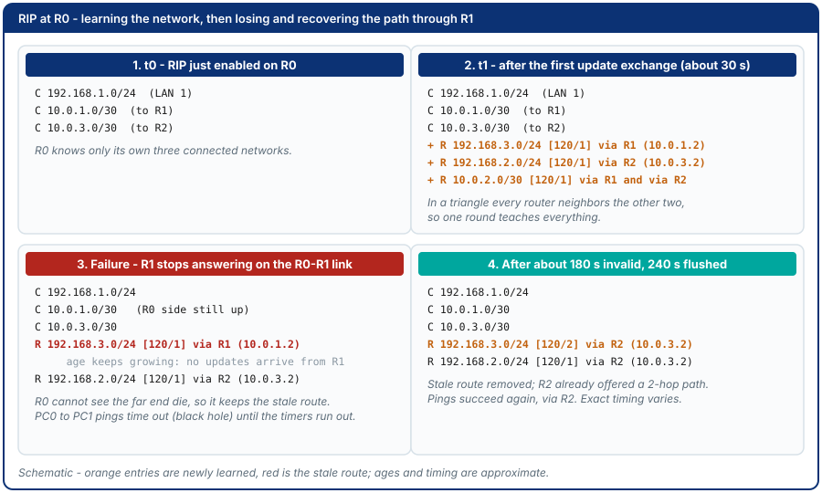

### Administrative Distance and Metric

When two sources offer a route to the same network, the router needs a tie-breaker that comes *before* the metric, because a RIP hop count and an EIGRP composite number cannot be compared. That tie-breaker is **administrative distance (AD)** - a trust rating from 0 to 255 where **lower wins**.

| Route source | AD |
|--------------|----|
| Directly connected | 0 |
| Static route | 1 |
| EIGRP (internal) | 90 |
| OSPF | 110 |
| RIP | 120 |

Every dynamic route in `show ip route` carries both numbers in brackets as **[AD/metric]**:

```
R    192.168.3.0/24 [120/1] via 10.0.1.2, 00:00:12, GigabitEthernet0/1
D    192.168.3.0/24 [90/3072] via 10.0.1.2, 00:01:05, GigabitEthernet0/1
```

- `R` / `D` - the source (RIP / EIGRP); `192.168.3.0/24` - the destination network.
- `[120/1]` - AD 120 (RIP), metric 1 hop. `[90/3072]` - AD 90 (EIGRP), composite metric 3072.
- `via 10.0.1.2` - the next-hop router; `00:00:12` - how long ago this route was last refreshed; `GigabitEthernet0/1` - the exit interface.
- If RIP and EIGRP both knew this network, the router would install the `D` route (90 beats 120) no matter what the metrics are.

### RIPv2 Configuration Pattern

```
router rip
 version 2
 network <classful-network>
 no auto-summary
```

- `network` uses **classful** network addresses (e.g., `192.168.1.0` not `192.168.1.0/24`, and `10.0.0.0` to cover every `10.x.x.x` subnet). RIP announces all interfaces whose IP falls within that classful network.
- `no auto-summary` prevents RIPv2 from summarizing routes at classful boundaries - essential for discontiguous subnets.
- RIP timers: update every **30 s**; a route is **invalid** after 180 s of silence, **held down** for 180 s, and **flushed** after 240 s.

### EIGRP Configuration Pattern

```
router eigrp <AS-number>
 network <network> <wildcard-mask>
 no auto-summary
```

- The AS (Autonomous System) number must match on all routers in the same domain.
- EIGRP uses a **wildcard mask** (inverse of subnet mask) in the `network` statement: `/24` becomes `0.0.0.255`, `/30` becomes `0.0.0.3`.
- EIGRP sends a **hello** every 5 s on fast links and declares a neighbor dead after **15 s** (the hold time) without one.

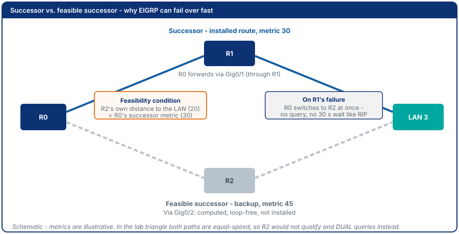

### Why Dynamic Routing Fixes the Problem

Static routes are configured once and never change. If a link fails, the static route still points down that link - traffic is black-holed. Dynamic protocols detect the failure (missing hellos / updates), remove the dead route, and install an alternate path automatically - **but only if an alternate path exists**. That is why this lab's topology is a triangle and not a straight line.

## Guided Lab

> Need a refresher on the CLI window and IOS prompt modes before you start? See the [CLI console diagram in Appendix C](appendix/packet-tracer-tips.md).

> **Before you start:** this lab is **self-contained**. Open a **new, empty** Packet Tracer file and build everything from scratch. Do **not** reuse the Module 5 file and do **not** carry over any static routes - dynamic routing must be the only thing teaching the routers about remote networks.

### Part A - Three-Router RIPv2 Triangle

The three routers form a **triangle** so that every pair of sites has two ways to reach each other. One of the three WAN links runs through a small switch (`SW-WAN`); you will use that switch in Part B to break the link in a way that only one router can see.

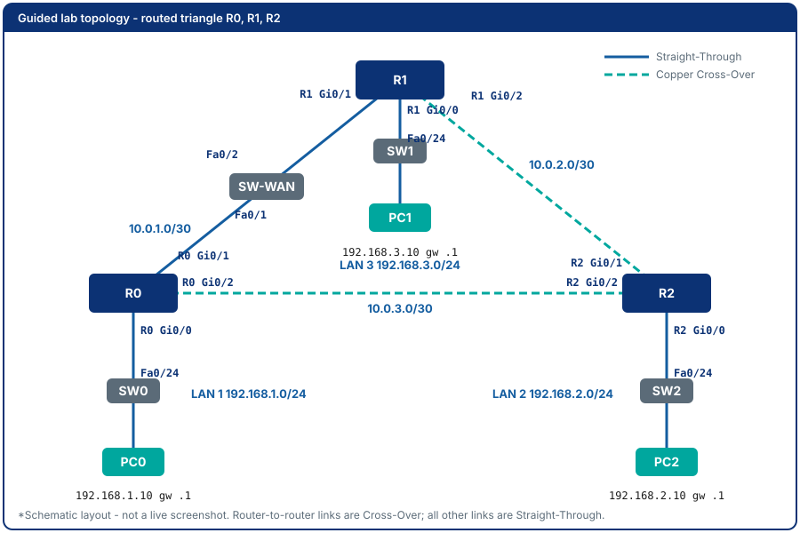

**Device checklist** - ten devices; place each one and rename it (click the label under its icon, or use the **Config** tab's **Display Name** field):

| # | Device name | PT model | Where in the palette | LAN |
|---|-------------|----------|----------------------|-----|
| 1 | R0 | Cisco 2911 | Network Devices → Routers → 2911 | LAN 1 |
| 2 | R1 | Cisco 2911 | Network Devices → Routers → 2911 | LAN 3 |
| 3 | R2 | Cisco 2911 | Network Devices → Routers → 2911 | LAN 2 |
| 4 | SW0 | Cisco 2960 | Network Devices → Switches → 2960 | LAN 1 |
| 5 | SW1 | Cisco 2960 | Network Devices → Switches → 2960 | LAN 3 |
| 6 | SW2 | Cisco 2960 | Network Devices → Switches → 2960 | LAN 2 |
| 7 | SW-WAN | Cisco 2960 | Network Devices → Switches → 2960 | inside the R0-R1 WAN link |
| 8 | PC0 | PC-PT | End Devices → PC-PT | LAN 1 |
| 9 | PC1 | PC-PT | End Devices → PC-PT | LAN 3 |
| 10 | PC2 | PC-PT | End Devices → PC-PT | LAN 2 |

**Cabling** - PC to switch and switch to router use **Copper Straight-Through**; the two direct router-to-router links use **Copper Cross-Over**:

| From (device : port) | To (device : port) | Cable type |
|----------------------|--------------------|------------|
| PC0 : FastEthernet0 | SW0 : Fa0/1 | Copper Straight-Through |
| SW0 : Fa0/24 | R0 : Gig0/0 | Copper Straight-Through |
| PC1 : FastEthernet0 | SW1 : Fa0/1 | Copper Straight-Through |
| SW1 : Fa0/24 | R1 : Gig0/0 | Copper Straight-Through |
| PC2 : FastEthernet0 | SW2 : Fa0/1 | Copper Straight-Through |
| SW2 : Fa0/24 | R2 : Gig0/0 | Copper Straight-Through |
| R0 : Gig0/1 | SW-WAN : Fa0/1 | Copper Straight-Through |
| SW-WAN : Fa0/2 | R1 : Gig0/1 | Copper Straight-Through |
| R1 : Gig0/2 | R2 : Gig0/1 | Copper Cross-Over |
| R0 : Gig0/2 | R2 : Gig0/2 | Copper Cross-Over |

> **Gig0/1** = GigabitEthernet0/1, the second onboard Gigabit interface of the 2911 (type + slot/port). Switch ports here are **Fa0/x** = FastEthernet. Packet Tracer asks which port to use when you click each device - match the table, do not accept the first option offered.

**Addressing:**

| Device | Interface | IP Address | Subnet Mask | Gateway |
|--------|-----------|------------|-------------|---------|
| R0 | Gig0/0 | 192.168.1.1 | 255.255.255.0 | - |
| R0 | Gig0/1 | 10.0.1.1 | 255.255.255.252 | - |
| R0 | Gig0/2 | 10.0.3.1 | 255.255.255.252 | - |
| R1 | Gig0/0 | 192.168.3.1 | 255.255.255.0 | - |
| R1 | Gig0/1 | 10.0.1.2 | 255.255.255.252 | - |
| R1 | Gig0/2 | 10.0.2.1 | 255.255.255.252 | - |
| R2 | Gig0/0 | 192.168.2.1 | 255.255.255.0 | - |
| R2 | Gig0/1 | 10.0.2.2 | 255.255.255.252 | - |
| R2 | Gig0/2 | 10.0.3.2 | 255.255.255.252 | - |
| PC0 | FastEthernet0 | 192.168.1.10 | 255.255.255.0 | 192.168.1.1 |
| PC1 | FastEthernet0 | 192.168.3.10 | 255.255.255.0 | 192.168.3.1 |
| PC2 | FastEthernet0 | 192.168.2.10 | 255.255.255.0 | 192.168.2.1 |

The three WAN subnets are `10.0.1.0/30` (R0-R1), `10.0.2.0/30` (R1-R2) and `10.0.3.0/30` (R0-R2). Use exactly these addresses - every student's lab uses the same plan, which makes screenshots comparable.

**Step 1. Place and rename the devices.** Place all ten devices from the checklist and rename each one.

**Step 2. Cable the topology.** Use the cabling table above, one row at a time. Wait for the lights to settle: **SW-WAN's ports show amber for about 30 seconds** before they turn green (the switch is checking for loops), and router ports stay **red until you run `no shutdown` in Step 4** - both are normal.

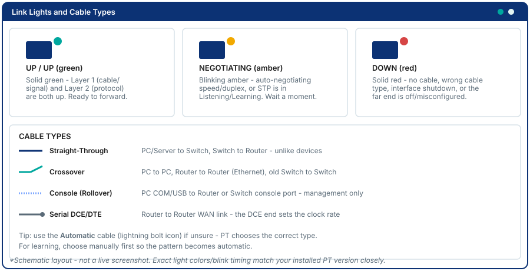

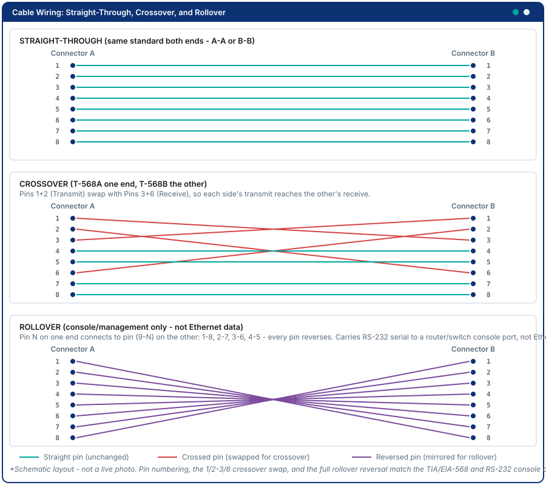

> **Router to router needs Cross-Over.** The two routers' Gig ports use the same pin pairs, so a straight-through cable between them leaves the link red or down. If a router-to-router link stays red after `no shutdown` on both ends, delete the cable and re-cable with Cross-Over.

📸 Screenshot the complete cabled topology with all ten devices labeled.
> **Expected output:** every PC and switch link is green; the router links are red until Step 4.

**Step 3. Configure the PCs.** Click each PC, open **Desktop → IP Configuration**, select **Static**, and enter the address, mask and default gateway from the addressing table (PC0 192.168.1.10 / gateway 192.168.1.1, PC1 192.168.3.10 / gateway 192.168.3.1, PC2 192.168.2.10 / gateway 192.168.2.1).

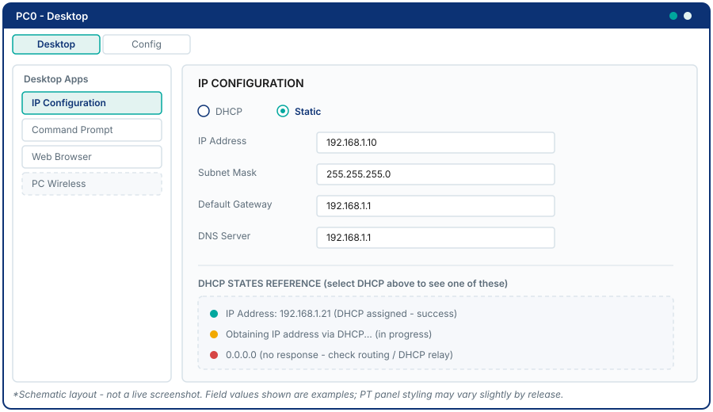

**Step 4. Configure the routers' hostnames and interfaces.** Click a router and open its **CLI** tab, press **Enter** to activate the console.

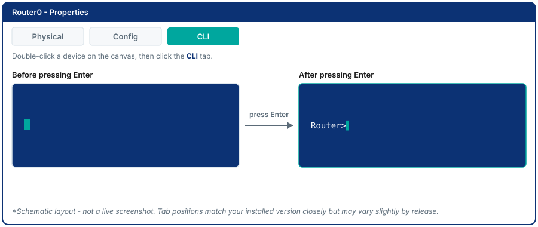

> **Mode switches matter.** Configuration commands only work in Global Configuration mode. The sequence below starts with `enable` (User EXEC `R>` to Privileged EXEC `R#`) and `configure terminal` (to `R(config)#`). Interface commands use `interface ...` (prompt becomes `R(config-if)#`) and `exit` returns one level. Before any `show` or `ping` command, type `end` to get back to `R#` (or prefix the command with `do` while in config mode).

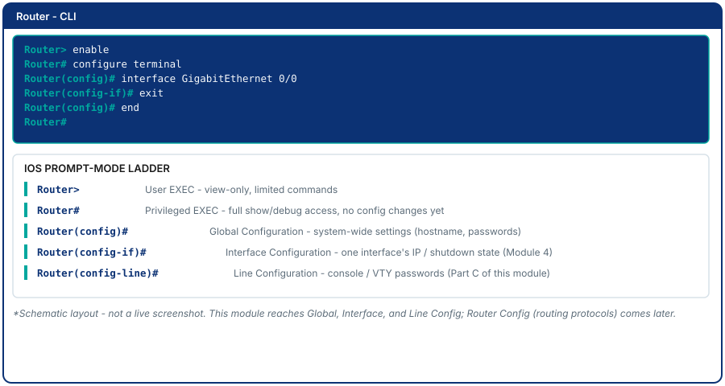

Router R0:

```
Router> enable
Router# configure terminal
Router(config)# hostname R0
R0(config)# no ip domain-lookup
R0(config)# interface GigabitEthernet0/0
R0(config-if)# ip address 192.168.1.1 255.255.255.0
R0(config-if)# no shutdown
R0(config-if)# exit
R0(config)# interface GigabitEthernet0/1
R0(config-if)# ip address 10.0.1.1 255.255.255.252
R0(config-if)# no shutdown
R0(config-if)# exit
R0(config)# interface GigabitEthernet0/2
R0(config-if)# ip address 10.0.3.1 255.255.255.252
R0(config-if)# no shutdown
R0(config-if)# end
```

Router R1:

```
Router> enable
Router# configure terminal
Router(config)# hostname R1
R1(config)# no ip domain-lookup
R1(config)# interface GigabitEthernet0/0
R1(config-if)# ip address 192.168.3.1 255.255.255.0
R1(config-if)# no shutdown
R1(config-if)# exit
R1(config)# interface GigabitEthernet0/1
R1(config-if)# ip address 10.0.1.2 255.255.255.252
R1(config-if)# no shutdown
R1(config-if)# exit
R1(config)# interface GigabitEthernet0/2
R1(config-if)# ip address 10.0.2.1 255.255.255.252
R1(config-if)# no shutdown
R1(config-if)# end
```

Router R2:

```
Router> enable
Router# configure terminal
Router(config)# hostname R2
R2(config)# no ip domain-lookup
R2(config)# interface GigabitEthernet0/0
R2(config-if)# ip address 192.168.2.1 255.255.255.0
R2(config-if)# no shutdown
R2(config-if)# exit
R2(config)# interface GigabitEthernet0/1
R2(config-if)# ip address 10.0.2.2 255.255.255.252
R2(config-if)# no shutdown
R2(config-if)# exit
R2(config)# interface GigabitEthernet0/2
R2(config-if)# ip address 10.0.3.2 255.255.255.252
R2(config-if)# no shutdown
R2(config-if)# end
```

> **Do NOT add any static routes** - none, on any router.

**Step 5. Verify what is directly connected - and what is not.** From R0 (at `R0#`), ping the neighbors on its own WAN links; from PC0, ping its gateway. All three succeed:

```
R0# ping 10.0.1.2
R0# ping 10.0.3.2
PC0> ping 192.168.1.1
```

Now try a **cross-site** ping from PC0 to PC1 (a LAN behind a different router):

```
C:\> ping 192.168.3.10
```

This **must fail**: R0 has no route to 192.168.3.0/24, so the first router on the path answers `Destination host unreachable` (the very first line may be `Request timed out` while the PC finishes ARP, then the unreachable replies follow).

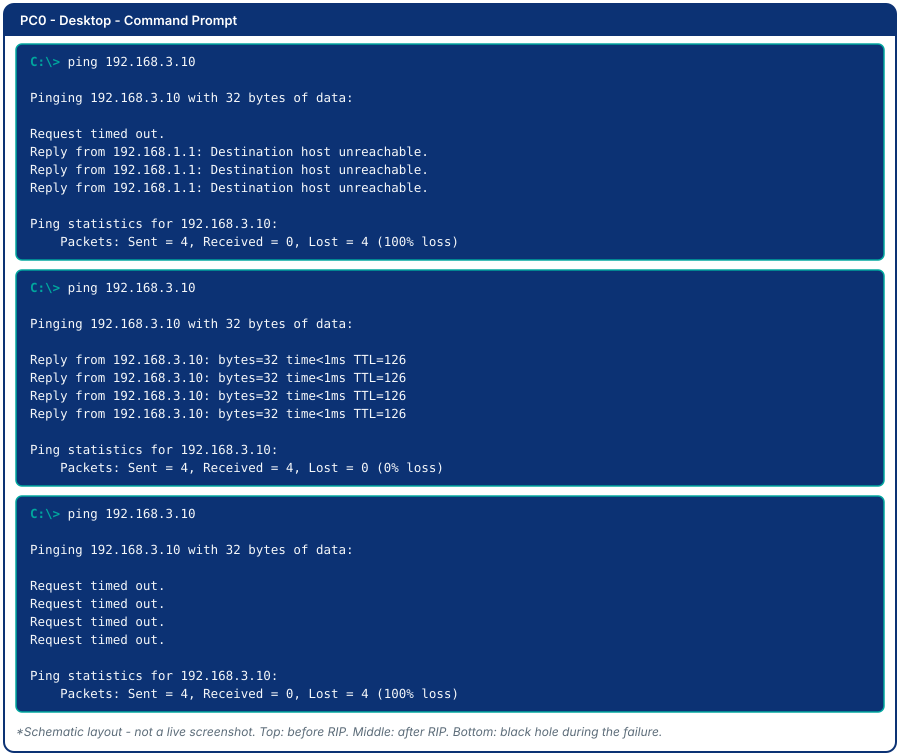

📸 Screenshot the failed ping.
> **Expected output:** `Reply from 192.168.1.1: Destination host unreachable.` - the reply comes from R0's LAN address, which tells you the packet reached R0 and R0 had nowhere to send it. 0 of 4 received (top panel above).

**Step 6. Configure RIPv2 on all three routers.** Each router advertises its **own** LAN plus the shared `10.0.0.0` WAN space. Do not copy R0's statements to the others - the LAN network is different on every router:

| Router | `network` statements to enter |
|--------|-------------------------------|
| R0 | `network 192.168.1.0` and `network 10.0.0.0` |
| R1 | `network 192.168.3.0` and `network 10.0.0.0` |
| R2 | `network 192.168.2.0` and `network 10.0.0.0` |

R0 (from `R0#`):

```
R0# configure terminal
R0(config)# router rip
R0(config-router)# version 2
R0(config-router)# network 192.168.1.0
R0(config-router)# network 10.0.0.0
R0(config-router)# no auto-summary
R0(config-router)# end
```

R1 (from `R1#`):

```
R1# configure terminal
R1(config)# router rip
R1(config-router)# version 2
R1(config-router)# network 192.168.3.0
R1(config-router)# network 10.0.0.0
R1(config-router)# no auto-summary
R1(config-router)# end
```

R2 (from `R2#`):

```
R2# configure terminal
R2(config)# router rip
R2(config-router)# version 2
R2(config-router)# network 192.168.2.0
R2(config-router)# network 10.0.0.0
R2(config-router)# no auto-summary
R2(config-router)# end
```

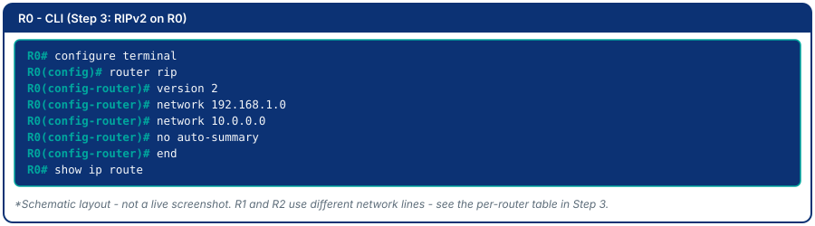

**Step 7. Wait for RIP to converge, then read the routing tables.** RIP sends updates every 30 seconds, so the tables fill in within about a minute. Click the **Fast Forward Time** button (the clock-with-arrows icon in the bottom toolbar) a few times instead of waiting. Optionally, watch the updates arrive with `R0# debug ip rip` for one round, then **turn it off with `undebug all`** - leaving debug running floods the screen.

```
R0# show ip route
R1# show ip route
```

![Schematic of show ip route on R0 with RIP-learned R entries and their [120/1] distance and metric](images/pt-m6-route-rip.svg)

📸 Screenshot the routing tables of R0 and R1.
> **Expected output:** `R` entries for every network the router is not directly attached to. On R0: `R 192.168.2.0/24 [120/1] via 10.0.3.2 ... GigabitEthernet0/2` and `R 192.168.3.0/24 [120/1] via 10.0.1.2 ... GigabitEthernet0/1`, plus two lines for `10.0.2.0/30` (equal-cost paths through both neighbors). The `L` lines are the router's own interface addresses and are normal on IOS 15.

> **Identify:** In `[120/1]`, which number is the administrative distance and which is the metric? Why is the metric 1 (one hop) for 192.168.3.0/24, a network attached to R1 and not to R0?

**Step 8. Test end-to-end connectivity.** From PC0:

```
C:\> ping 192.168.3.10
C:\> ping 192.168.2.10
```

📸 Screenshot the successful pings.
> **Expected output:** `Reply from 192.168.3.10: bytes=32 time<1ms TTL=126`, 4 of 4 received (middle panel in the ping image above). TTL 126 = 128 minus the two routers the packet crossed. If the first try shows one timeout, ARP was resolving; run it again.

---

### Part B - RIP Verification & Link Failure Simulation

**Step 9. Run the diagnostic commands on R0** (from `R0#`):

```
R0# show ip protocols
R0# show ip rip database
```

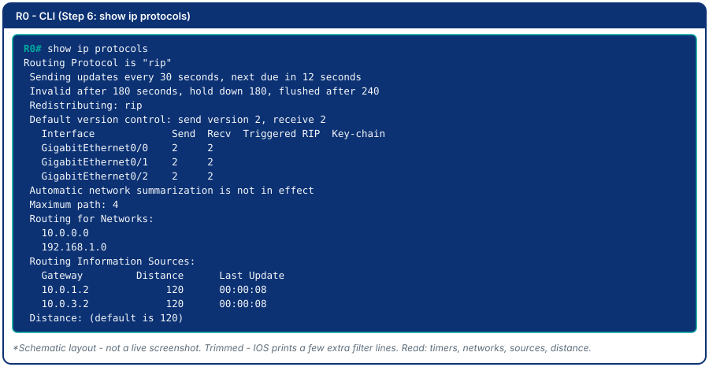

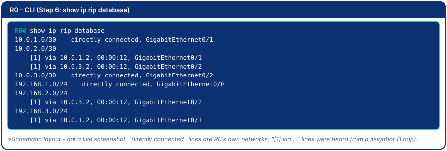

📸 Screenshot both outputs.
> **Expected output:** `show ip protocols` shows `Routing Protocol is "rip"`, updates every 30 seconds, invalid after 180 and flushed after 240, `Routing for Networks: 10.0.0.0 and 192.168.1.0`, two sources (10.0.1.2 and 10.0.3.2) at distance 120, and `Maximum path: 4`. `show ip rip database` lists R0's own networks as `directly connected` and every other network as `[1] via <neighbor>`.

> **Record:** Which networks is R0 routing for? What is the update timer? What is the maximum number of equal-cost paths? Which database entries are "directly connected" and which are learned "via" a neighbor?

**Step 10. Prepare the observation.** The failure you will create must be one that **R0 cannot see directly**. If you shut down R0's own port, R0 notices instantly (its link goes down, RIP removes the routes and tells its neighbors at once) and you would learn nothing about RIP's timers. So the break goes on the **far side** of `SW-WAN`: you will shut down **R1's** Gig0/1. R0's link to `SW-WAN` stays up, and R0 can only discover the problem by *not hearing* from R1 any more.

First, on R0, confirm the starting point:

```
R0# show ip route
```

Note that `192.168.3.0/24` is learned via `10.0.1.2` (R1). From PC0, start a continuous ping and leave the window open:

```
C:\> ping -t 192.168.3.10
```

(If your Packet Tracer build does not accept `-t`, run `ping 192.168.3.10` repeatedly instead.)

**Step 11. Break the link on R1's side.** On R1:

```
R1# configure terminal
R1(config)# interface GigabitEthernet0/1
R1(config-if)# shutdown
R1(config-if)# end
```

> You can also fail a link by deleting the cable: choose the **Delete** tool (the X icon in the Common Tools bar on the right), then click the cable between `SW-WAN` and R1. Do not use a right-click menu for this. `shutdown` is the more reliable way and is what the rest of the lab assumes.

**Step 12. Watch RIP notice.** Switch to R0's CLI. Immediately run `show ip route` and look at the age of the `192.168.3.0/24` line; look at PC0's continuous ping. Then use **Fast Forward Time** and repeat both about every 30 seconds of simulated time. Fill in a log like this:

| Time since failure (approx.) | R0's route to 192.168.3.0/24 | PC0 to PC1 ping |
|------------------------------|-------------------------------|-----------------|
| 0 s | ? | ? |
| 60 s | ? | ? |
| 120 s | ? | ? |
| 180 s | ? | ? |
| 240 s | ? | ? |
| 300 s | ? | ? |

Also run `R0# show ip rip database` once or twice - near the end of the wait the stale entry is marked `possibly down` before it disappears.

📸 Screenshot R0's `show ip route` at the start, in the middle (stale route, big age), and after recovery; screenshot the ping window showing the failures.
> **Expected output:** for the first minutes R0 **keeps** `R 192.168.3.0/24 [120/1] via 10.0.1.2` and the age keeps growing (00:02:30, 00:03:00 ...), while PC0's pings to PC1 time out (bottom panel in the ping image) - R0 is still sending traffic toward a router that no longer answers. After roughly 3 to 4 minutes of simulated time (180 s invalid, 240 s flushed) the line is replaced by `R 192.168.3.0/24 [120/2] via 10.0.3.2 ... GigabitEthernet0/2` (2 hops, through R2), and pings succeed again. PC0 to PC2 works the whole time, because that path never used the failed link.

> **Observe:** How long did R0 keep the dead route? What does RIP use as a "route is dead" signal when it cannot see the link itself? Why is the new metric 2 and the old one was 1?

**Step 13. Restore the link before moving on.** On R1:

```
R1# configure terminal
R1(config)# interface GigabitEthernet0/1
R1(config-if)# no shutdown
R1(config-if)# end
```

(If you deleted the cable instead, re-cable `SW-WAN : Fa0/2` to `R1 : Gig0/1` with Copper Straight-Through.) Wait for the port to turn green, fast-forward a minute, and confirm on R0 that `192.168.3.0/24` is back via `10.0.1.2` with `[120/1]` and the ping to PC1 still works. **Do this before Part C**: EIGRP needs all three neighbor links up to show a clean result.

---

### Part C - EIGRP Configuration

**Step 14. Remove RIP and configure EIGRP 100 on all three routers.** EIGRP's `network` statements are per-link and use wildcard masks, so again each router has a different list. Use AS number `100` on every router:

| Router | `network` statements to enter |
|--------|-------------------------------|
| R0 | `network 192.168.1.0 0.0.0.255`, `network 10.0.1.0 0.0.0.3`, `network 10.0.3.0 0.0.0.3` |
| R1 | `network 192.168.3.0 0.0.0.255`, `network 10.0.1.0 0.0.0.3`, `network 10.0.2.0 0.0.0.3` |
| R2 | `network 192.168.2.0 0.0.0.255`, `network 10.0.2.0 0.0.0.3`, `network 10.0.3.0 0.0.0.3` |

R0 (from `R0#`):

```
R0# configure terminal
R0(config)# no router rip
R0(config)# router eigrp 100
R0(config-router)# network 192.168.1.0 0.0.0.255
R0(config-router)# network 10.0.1.0 0.0.0.3
R0(config-router)# network 10.0.3.0 0.0.0.3
R0(config-router)# no auto-summary
R0(config-router)# end
```

R1 (from `R1#`):

```
R1# configure terminal
R1(config)# no router rip
R1(config)# router eigrp 100
R1(config-router)# network 192.168.3.0 0.0.0.255
R1(config-router)# network 10.0.1.0 0.0.0.3
R1(config-router)# network 10.0.2.0 0.0.0.3
R1(config-router)# no auto-summary
R1(config-router)# end
```

R2 (from `R2#`):

```
R2# configure terminal
R2(config)# no router rip
R2(config)# router eigrp 100
R2(config-router)# network 192.168.2.0 0.0.0.255
R2(config-router)# network 10.0.2.0 0.0.0.3
R2(config-router)# network 10.0.3.0 0.0.0.3
R2(config-router)# no auto-summary
R2(config-router)# end
```

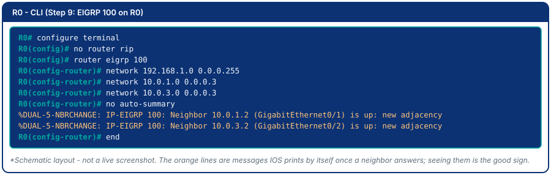

As each neighbor answers, IOS prints a `%DUAL-5-NBRCHANGE ... is up` message.

**Step 15. Verify the neighbor relationships.**

```
R0# show ip eigrp neighbors
```

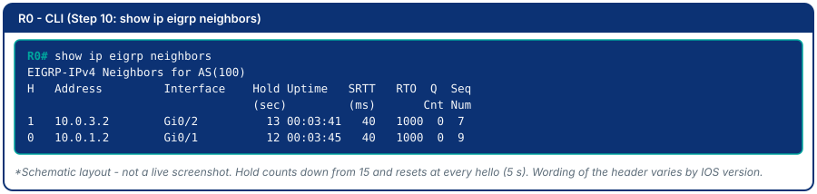

📸 Screenshot.
> **Expected output:** two neighbors on R0, `10.0.1.2` on Gi0/1 and `10.0.3.2` on Gi0/2, each with an Uptime counting up and a Hold value between 10 and 15 that keeps resetting. If a neighbor is missing, check the AS number and the `network` lines on both ends.

> **Identify:** What is the "Uptime" column showing? What does the "Hold" column count down from, and what does it mean if a neighbor disappears from this list?

**Step 16. Compare routing tables.**

```
R0# show ip route
```

![Schematic of show ip route on R0 with EIGRP-learned D entries and their [90/3072] distance and metric](images/pt-m6-route-eigrp.svg)

📸 Screenshot and annotate the `D` entries.
> **Expected output:** the `R` entries are gone, replaced by `D 192.168.2.0/24 [90/3072] via 10.0.3.2 ...` and `D 192.168.3.0/24 [90/3072] via 10.0.1.2 ...`. The exact metric numbers depend on your Packet Tracer version, but they are far larger than RIP's hop counts and the AD is 90.

> **Identify:** What replaced `[120/1]`? Which number would win if both protocols were still running?

**Step 17. Repeat the failure under EIGRP.** Check the PC0 to PC1 ping works, then start `ping -t 192.168.3.10` on PC0 again. On R1, shut Gig0/1 exactly as in Step 11. On R0, repeat `show ip eigrp neighbors` every few seconds and watch the **Hold** value for `10.0.1.2` count down. Then run `show ip route` on R0.

📸 Screenshot the neighbor table while Hold is low, and the routing table after reconvergence.
> **Expected output:** the Hold value for `10.0.1.2` counts down to 0 within about 15 seconds, IOS prints `%DUAL-5-NBRCHANGE ... Neighbor 10.0.1.2 (GigabitEthernet0/1) is down: holding time expired`, the neighbor disappears from the table, and `192.168.3.0/24` is now `D ... via 10.0.3.2 ... GigabitEthernet0/2` with a larger metric. The pings stop only for roughly that 15 seconds and then resume - compared with several minutes under RIP.

> **Explain:** Why does EIGRP converge faster than RIP? (Hint: research "DUAL algorithm" and "feasible successor.") In this triangle both backup and primary paths are equal-speed links, so R2 may not qualify as a feasible successor and DUAL may have to ask its neighbors briefly - the 15 s hold time dominates the delay either way.

**Step 18. Restore the link.** On R1, `no shutdown` on Gig0/1 as in Step 13. Confirm with `show ip eigrp neighbors` on R0 that `10.0.1.2` is back, and that `192.168.3.0/24` returns via `10.0.1.2`.

**Step 19. Save your work: File → Save As** → `StudentID_Module6.pka`.

---

## Challenge Tasks

1. Fail a link that R0 **can** see directly: shut down R0's own Gig0/1 (not R1's). Time how fast RIP reacts compared with Step 12 and explain the difference (hint: triggered updates and route poisoning versus waiting for a timer).
2. Run RIP and EIGRP **together** on all routers for a minute and read `show ip route`: which protocol's routes are installed, and why? (Hint: administrative distance.)
3. Configure EIGRP unequal-cost load balancing with the `variance` command. Research what `variance 2` does and demonstrate it on a topology that has two paths of different bandwidth.
4. Research what happens when two EIGRP routers have different AS numbers. Configure this deliberately and observe whether a neighbor relationship forms. Explain why the AS number must match.

> **Looking ahead:** routing now delivers a packet anywhere in your network - automatically - but it never asks *whether it should*. PC0 can reach every host on every LAN. Module 7 introduces Access Control Lists (ACLs) to filter traffic on top of this working routed network.

## Deliverables

1. Topology screenshot with all IP addresses labeled.
2. Screenshot of the failed pre-routing ping (`Destination host unreachable`).
3. Routing table screenshots (R0 and R1) after RIPv2 converges, with `R` entries annotated and administrative distance/metric labeled.
4. Successful end-to-end ping after RIP convergence.
5. Link-failure observation log (the Step 12 table, filled in) with before, during and after screenshots and a written explanation of why R0 kept the stale route and how long RIP took to recover.
6. `show ip eigrp neighbors` and the routing table after EIGRP configuration, with `D` entries annotated and AD/metric labeled.
7. Written comparison of RIP vs. EIGRP failure recovery time from your own observation (numbers, not just textbook).
8. Your saved `.pka` file.

## Assessment Rubric

| Criterion | Points |
|-----------|--------|
| RIPv2 configured, routing table shows `R` entries with AD/metric explained | 25 |
| Full connectivity verified across the three-router topology | 15 |
| Link failure: observation log, stale-route explanation, recovery shown (route moves to R2) | 20 |
| EIGRP configured, neighbors up, routing table shows `D` entries | 25 |
| RIP vs. EIGRP comparison (concrete measured observation, not just textbook) | 15 |
| **Total** | **100** |
