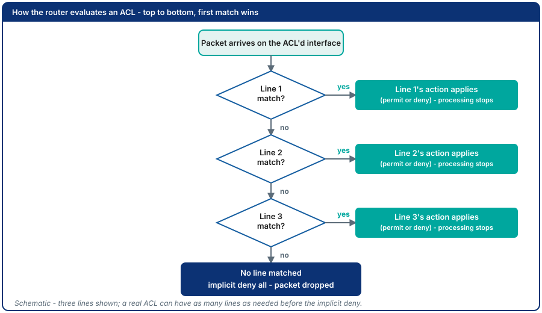
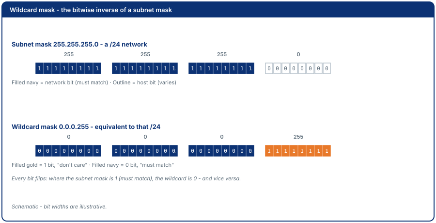
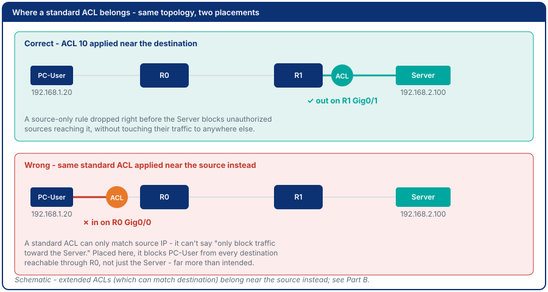
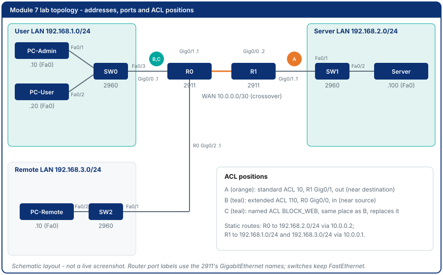
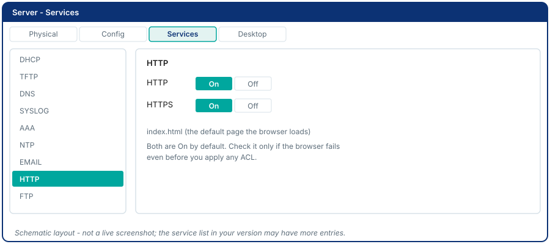
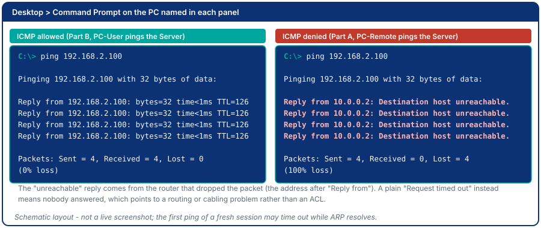
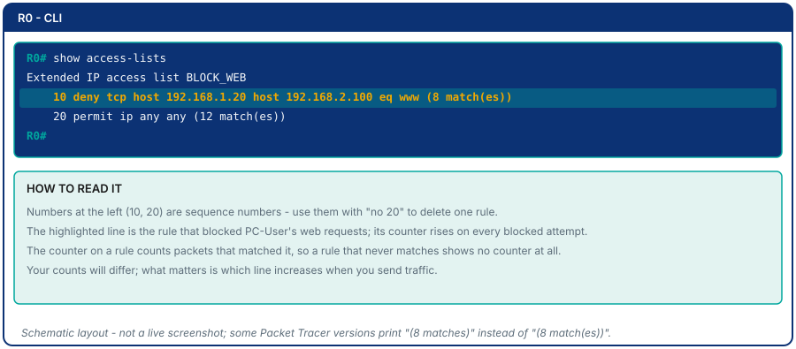
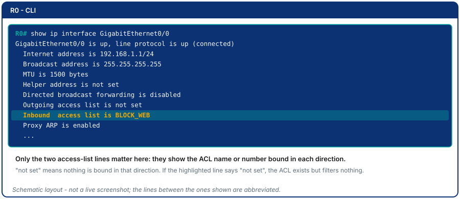
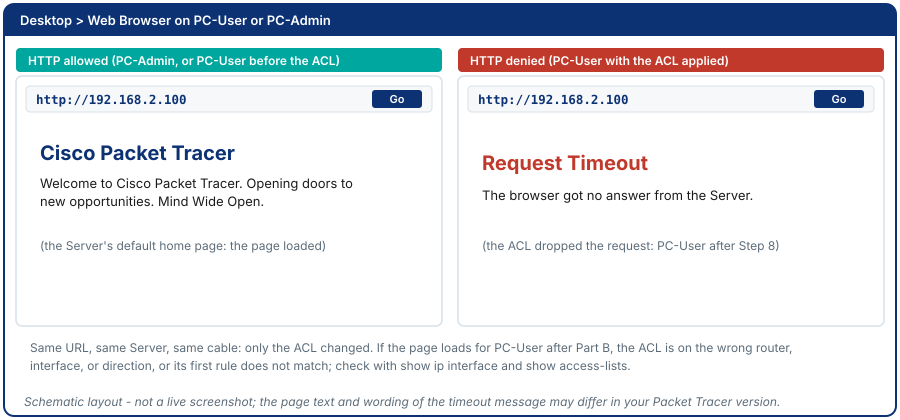
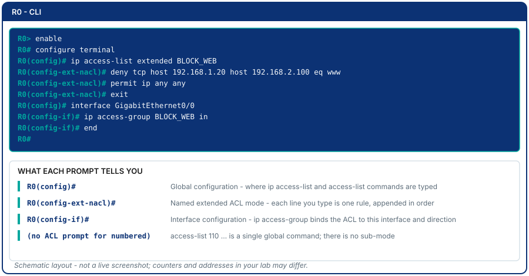

# Module 7 - Access Control Lists

## Why This Matters

In 2020, a ransomware attack on the University Hospital Düsseldorf forced the hospital to redirect emergency patients to other facilities - and one patient died during the delay. The attackers had entered through a remote-access server that had no traffic restrictions: any IP address could connect to port 443 and exploit the vulnerability. An Access Control List (ACL) placed at the right interface would not have stopped a determined attacker indefinitely, but it would have restricted which source addresses could even *reach* the vulnerable service - dramatically shrinking the attack surface. ACLs are the most widely deployed traffic-filtering tool in the world. They are in every corporate router, every ISP core, and every campus network. This module teaches you to write them correctly - because an ACL placed at the wrong interface, or with rules in the wrong order, either blocks legitimate traffic or passes everything it was meant to block.

## Learning Outcomes

By the end of this lab, students are able to:

1. Explain the difference between standard and extended ACLs and when to use each.
2. Write numbered and named ACL rules using wildcard masks.
3. Apply an ACL to the correct interface and direction (inbound vs. outbound).
4. Use `show access-lists` and `show ip interface` to verify ACL operation.
5. Debug a misconfigured ACL by reading hit counts.

## Pre-Lab

**Read before class:** Cisco CCNA Exploration Chapter on ACLs; ACL wildcard mask tutorial.

**Answer before the session:**

1. What is the difference between a wildcard mask and a subnet mask? What does a `1` bit mean in a wildcard mask?
2. What wildcard mask matches *exactly one host* (a specific IP)? What wildcard mask matches *all hosts*?
3. In what direction should a standard ACL be applied, and as close to which device (source or destination)? Why?
4. In what direction should an extended ACL be applied, and as close to which device? Why?
5. What happens to a packet that does not match any ACL entry? (What is the implicit last rule?)

## Equipment & Materials

- Cisco Packet Tracer 9.x
- This lab is self-contained: build it fresh in a new file. Nothing from Module 5 or 6 is needed.

## Estimated Time (In-Class Lab, ~2 hrs)

| Phase | Time |
|-------|------|
| Before you start: build, address and route | 25 min |
| Part A: Standard ACL | 25 min |
| Part B: Extended ACL | 30 min |
| Part C: Named ACL & debugging | 20 min |

*Guided Lab activities above run about 100 minutes - the rest of the 2-hour block covers troubleshooting, Challenge Tasks, and lab-report writeup.*

## Theory Review

### Standard vs. Extended ACLs

| Property | Standard ACL | Extended ACL |
|----------|-------------|-------------|
| Matches on | Source IP only | Source IP, Destination IP, Protocol, Port |
| Numbered range | 1-99, 1300-1999 | 100-199, 2000-2699 |
| Best placed | Close to destination | Close to source |
| Use case | Block/permit a source entirely | Block specific traffic type (e.g., HTTP only) |

### Direction: `in` and `out`

`ip access-group <number or name> in|out` binds an ACL to one interface. Direction is always from the **router's** point of view: `in` filters packets as they arrive on that interface (before the routing decision); `out` filters packets as they leave it (after the routing decision). An ACL that exists but is bound to the wrong interface or direction filters nothing.


### ACL Processing Rules

1. Rules are evaluated **top to bottom**; the first match wins.
2. If no rule matches: **implicit deny all** (packets dropped silently).
3. Order matters: a `permit any` before a `deny` renders the deny unreachable.
4. Each interface can have **one ACL per direction** (one in, one out).



### Wildcard Mask Quick Reference

| Wildcard | Matches |
|----------|---------|
| `0.0.0.0` | Exactly one host (host keyword) |
| `0.0.0.255` | All hosts in a /24 network |
| `0.0.3.255` | All hosts in a /22 (two /23 blocks) |
| `255.255.255.255` | All addresses (any keyword) |

Shorthand: `host 192.168.1.10` = `192.168.1.10 0.0.0.0`; `any` = `0.0.0.0 255.255.255.255`.



### Why ACL Placement Fixes the Security Problem

A standard ACL placed outbound on the router interface *facing the vulnerable server* would drop traffic from unauthorized source IPs just before it reaches the server - without blocking legitimate hosts on the authorized subnet. An extended ACL can name the destination and port, so it goes the other way: inbound on the router interface *nearest the source*, where unwanted traffic is dropped before it crosses the network.



## Guided Lab

> Need a refresher on the CLI window and IOS prompt modes before you start? See the [CLI console diagram in Appendix C](appendix/packet-tracer-tips.md).

### Before You Start: Build the Topology

Open a new Packet Tracer file. The checklist below is the complete list of devices; build exactly these and nothing else.



**Device checklist** (2 routers, 3 switches, 3 PCs, 1 server):

| Device name | Packet Tracer model | Palette path | LAN |
|-------------|--------------------|--------------|-----|
| R0 | 2911 | Network Devices > Routers | gateway for User LAN and Remote LAN |
| R1 | 2911 | Network Devices > Routers | gateway for Server LAN |
| SW0 | 2960 | Network Devices > Switches | User LAN |
| SW1 | 2960 | Network Devices > Switches | Server LAN |
| SW2 | 2960 | Network Devices > Switches | Remote LAN |
| PC-Admin | PC-PT | End Devices > End Devices | User LAN |
| PC-User | PC-PT | End Devices > End Devices | User LAN |
| PC-Remote | PC-PT | End Devices > End Devices | Remote LAN |
| Server | Server-PT | End Devices > End Devices | Server LAN |

The 2911 has three onboard GigabitEthernet ports (Gig0/0, Gig0/1, Gig0/2), so R0 needs no expansion module. Rename each device by clicking its label.

**Cabling table** (Connections > Copper Straight-Through or Copper Cross-Over):

| From | To | Cable |
|------|----|-------|
| PC-Admin Fa0 | SW0 Fa0/1 | Straight-through |
| PC-User Fa0 | SW0 Fa0/2 | Straight-through |
| SW0 Fa0/3 | R0 Gig0/0 | Straight-through |
| R0 Gig0/1 | R1 Gig0/0 | Copper Cross-Over |
| R1 Gig0/1 | SW1 Fa0/1 | Straight-through |
| SW1 Fa0/2 | Server Fa0 | Straight-through |
| R0 Gig0/2 | SW2 Fa0/1 | Straight-through |
| SW2 Fa0/2 | PC-Remote Fa0 | Straight-through |


📸 Screenshot of your finished topology. Expected output: every link light is green (routers stay red until Step 2 below because router ports start shut down).

**Addressing table:**

| Device | Interface | IP address | Subnet mask | Default gateway |
|--------|-----------|------------|-------------|-----------------|
| R0 | Gig0/0 | 192.168.1.1 | 255.255.255.0 | n/a |
| R0 | Gig0/1 | 10.0.0.1 | 255.255.255.252 | n/a |
| R0 | Gig0/2 | 192.168.3.1 | 255.255.255.0 | n/a |
| R1 | Gig0/0 | 10.0.0.2 | 255.255.255.252 | n/a |
| R1 | Gig0/1 | 192.168.2.1 | 255.255.255.0 | n/a |
| PC-Admin | Fa0 | 192.168.1.10 | 255.255.255.0 | 192.168.1.1 |
| PC-User | Fa0 | 192.168.1.20 | 255.255.255.0 | 192.168.1.1 |
| PC-Remote | Fa0 | 192.168.3.10 | 255.255.255.0 | 192.168.3.1 |
| Server | Fa0 | 192.168.2.100 | 255.255.255.0 | 192.168.2.1 |

**Step 1.** Address each PC and the Server: click the device, then **Desktop > IP Configuration**, choose **Static**, and type the IP address, subnet mask and default gateway from the table.


**Step 2.** Configure the routers. Click R0, open the **CLI** tab and press Enter.


```
Router> enable
Router# configure terminal
Router(config)# hostname R0
R0(config)# interface GigabitEthernet0/0
R0(config-if)# ip address 192.168.1.1 255.255.255.0
R0(config-if)# no shutdown
R0(config-if)# interface GigabitEthernet0/1
R0(config-if)# ip address 10.0.0.1 255.255.255.252
R0(config-if)# no shutdown
R0(config-if)# interface GigabitEthernet0/2
R0(config-if)# ip address 192.168.3.1 255.255.255.0
R0(config-if)# no shutdown
R0(config-if)# exit
R0(config)# ip route 192.168.2.0 255.255.255.0 10.0.0.2
R0(config)# end
R0# write memory
```

Now click R1 and repeat in its own CLI tab:

```
Router> enable
Router# configure terminal
Router(config)# hostname R1
R1(config)# interface GigabitEthernet0/0
R1(config-if)# ip address 10.0.0.2 255.255.255.252
R1(config-if)# no shutdown
R1(config-if)# interface GigabitEthernet0/1
R1(config-if)# ip address 192.168.2.1 255.255.255.0
R1(config-if)# no shutdown
R1(config-if)# exit
R1(config)# ip route 192.168.1.0 255.255.255.0 10.0.0.1
R1(config)# ip route 192.168.3.0 255.255.255.0 10.0.0.1
R1(config)# end
R1# write memory
```

The static routes are what make every LAN reachable: R0 sends Server-bound traffic to R1, and R1 sends User-LAN and Remote-LAN traffic back through R0. Without the return routes the Server would receive requests but its replies would never get home.


**Step 3.** Verify the baseline before any ACL exists. From each PC, open **Desktop > Command Prompt**:

```
PC-Admin> ping 192.168.2.100
PC-User> ping 192.168.2.100
PC-Remote> ping 192.168.2.100
```

> If the first ping of a PC shows `Request timed out`, run it again: the first packet waits for ARP (Address Resolution Protocol) to learn the gateway's MAC address. If you ever change a device's IP address and old replies keep coming back, run `arp -d` in that PC's Command Prompt to clear its ARP cache.

📸 Screenshot confirming all three PCs can ping the Server (baseline). Expected output: `Reply from 192.168.2.100` with 0% loss for each.

Also confirm the Server's web service works before blocking it: on PC-Admin choose **Desktop > Web Browser**, type `http://192.168.2.100` and press Go. The Server's default page should load. If it does not, click the Server, open **Services > HTTP** and make sure HTTP is **On**.



📸 Screenshot of the Server's page loaded in the browser. Expected output: the "Cisco Packet Tracer" welcome page.

---

### Part A - Standard ACL: Restrict Server Access by Source

**Scenario:** Only the User LAN (192.168.1.0/24) may reach the Server, with one exception: PC-User (192.168.1.20) has been flagged as compromised and is blocked. PC-Remote (192.168.3.x) is not allowed at all. A standard ACL matches only the source address, so it belongs close to the **destination**: put it on the router interface that faces the Server, in the **out** direction.

**Step 1.** Create standard ACL 10 on R1 (specific host deny first, then the broad permit, then an explicit deny so you can see its hit count):

```
R1# configure terminal
R1(config)# access-list 10 deny host 192.168.1.20
R1(config)# access-list 10 permit 192.168.1.0 0.0.0.255
R1(config)# access-list 10 deny any
```

> **Note:** The `deny any` is explicit here for clarity; in production you would rely on the implicit deny, but making it explicit lets you see hit counts.

> **Order matters:** PC-User is inside 192.168.1.0/24, so the `permit` line would match it too. Because `deny host 192.168.1.20` is listed first, PC-User is stopped before the permit is ever reached.

**Step 2.** Apply the ACL outbound on R1 Gig0/1, the interface facing the Server. We pick this placement because a standard ACL sees only the source, so it must sit as close to the destination as possible: every other path in the network is left untouched, and the same rule guards everything that leaves toward the Server LAN.

```
R1(config)# interface GigabitEthernet0/1
R1(config-if)# ip access-group 10 out
R1(config-if)# end
```

The Server's replies enter R1 on Gig0/1 (inbound), where this ACL does not look, so allowed sessions work in both directions.

**Step 3.** Test from all three PCs:

```
PC-Admin> ping 192.168.2.100
PC-User> ping 192.168.2.100
PC-Remote> ping 192.168.2.100
```



📸 Screenshot: Admin ping succeeds; User and Remote pings fail. Expected output: PC-Admin gets four replies; PC-User and PC-Remote get `Destination host unreachable` (the first ping may time out instead, because of ARP).

**Step 4.** Verify the ACL and observe hit counts on R1:

```
R1# show access-lists
R1# show ip interface GigabitEthernet0/1
```



*The image shows the named ACL you will build in Part C; numbered ACL 10 prints the same way, headed "Standard IP access list 10" with three lines (10, 20, 30).*



*On R1 Gig0/1 the highlighted line you are looking for is `Outgoing access list is 10`.*

📸 Screenshot of both outputs. Expected output: line 10 (`deny host 192.168.1.20`) shows matches from PC-User, line 20 (`permit 192.168.1.0 0.0.0.255`) shows matches from PC-Admin, line 30 (`deny any`) shows matches from PC-Remote, and `Outgoing access list is 10`. Identify which rule matched how many times.

> **Observe:** Send two more pings from PC-Remote. Run `show access-lists` again. Which counter changed, and by how much?

> **Explain:** What would happen to PC-Admin if lines 1 and 2 were swapped?

---

### Part B - Extended ACL: Block Specific Service

**Scenario:** PC-User (192.168.1.20) should be able to ping the Server (ICMP) but must NOT be able to browse its website (HTTP, port 80). An extended ACL can match destination and port, so it goes close to the **source**: inbound on R0 Gig0/0, where PC-User's traffic first enters the router. Create, apply, test and (later) remove it all on **R0**.

**Step 5.** Clear Part A first. Remove the binding from the interface *before* deleting the ACL, otherwise a stale `ip access-group 10 out` line can linger on the interface:

```
R1# configure terminal
R1(config)# interface GigabitEthernet0/1
R1(config-if)# no ip access-group 10 out
R1(config-if)# exit
R1(config)# no access-list 10
R1(config)# end
```

Check that PC-User can ping the Server again. Expected output: replies, which means R1 is clean.

**Step 6.** On R0, create extended ACL 110:

```
R0# configure terminal
R0(config)# access-list 110 deny tcp host 192.168.1.20 host 192.168.2.100 eq 80
R0(config)# access-list 110 permit ip any any
```

> **Order matters:** The specific deny must appear before the general permit. Explain why. The final `permit ip any any` is required: without it the implicit deny would drop every other packet entering the interface.

**Step 7.** Apply it inbound on R0 Gig0/0, the interface PC-User's traffic enters (close to the source, the correct placement for extended ACLs):

```
R0(config)# interface GigabitEthernet0/0
R0(config-if)# ip access-group 110 in
R0(config-if)# end
```

Only traffic arriving on Gig0/0 is filtered. PC-Remote enters R0 on Gig0/2, so it is not affected by this ACL.

**Step 8.** Test both services from PC-User:

- On PC-User, **Desktop > Command Prompt**: `ping 192.168.2.100` - should **succeed** (ICMP is not blocked).
- On PC-User, **Desktop > Web Browser**, type `http://192.168.2.100` and press Go - should **fail** (HTTP port 80 blocked).
- On PC-Admin, repeat the browser test - should **succeed** (only PC-User is denied).



📸 Screenshot both PC-User results. Expected output: four ping replies, and a browser page that does not load (`Request Timeout` or an empty page, depending on version).

Then on R0 run `show access-lists 110`.

📸 Screenshot. Expected output: the `deny tcp host 192.168.1.20 ... eq www` line shows a match count above zero, and `permit ip any any` also shows matches from the pings.

> **Explain:** Why is the extended ACL placed close to the source (R0's LAN interface), not close to the server? What is the efficiency argument?

---

### Part C - Named ACL & Debugging

**Step 9.** Replace the numbered ACL with a named ACL (more readable and easier to edit). Unbind, delete, then build the new one on the same router, R0:

```
R0# configure terminal
R0(config)# interface GigabitEthernet0/0
R0(config-if)# no ip access-group 110 in
R0(config-if)# exit
R0(config)# no access-list 110
R0(config)# ip access-list extended BLOCK_WEB
R0(config-ext-nacl)# deny tcp host 192.168.1.20 host 192.168.2.100 eq www
R0(config-ext-nacl)# permit ip any any
R0(config-ext-nacl)# exit
R0(config)# interface GigabitEthernet0/0
R0(config-if)# ip access-group BLOCK_WEB in
R0(config-if)# end
```



📸 Screenshot of your CLI session. Expected output: the prompts change to `R0(config-ext-nacl)#` while you type the rules and back to `R0(config-if)#` after the `ip access-group` line.

**Step 10.** Verify:

```
R0# show access-lists BLOCK_WEB
R0# show ip interface GigabitEthernet0/0
```

📸 Screenshot the named ACL output and note which interface and direction it is applied to. Expected output: `Extended IP access list BLOCK_WEB` with lines 10 and 20, and `Inbound  access list is BLOCK_WEB` in the `show ip interface` output. Repeat the browser test from PC-User to confirm the web page is still blocked.

**Step 11.** Deliberate mistake: delete the `permit ip any any` line and retest. Named ACL entries carry sequence numbers, so find the number first:

```
R0# show access-lists BLOCK_WEB
R0# configure terminal
R0(config)# ip access-list extended BLOCK_WEB
R0(config-ext-nacl)# no 20
R0(config-ext-nacl)# end
```

Now test from PC-Admin: `ping 192.168.2.100`.

> **Observe:** Which traffic is affected now? Can PC-Admin reach the Server? Can PC-Remote? Remember the ACL is bound only to Gig0/0, inbound. Why does PC-Admin fail even though no rule mentions it?

📸 Screenshot. Expected output: PC-Admin gets `Destination host unreachable`; PC-Remote still reaches the Server because its traffic never crosses Gig0/0.

Fix it by adding the line back at the end of the list:

```
R0(config)# ip access-list extended BLOCK_WEB
R0(config-ext-nacl)# permit ip any any
R0(config-ext-nacl)# end
```

(If `permit ip any any` ends up before the deny, type `no <sequence>` for it and add it again; a new line is always appended at the bottom.) Verify with `show access-lists BLOCK_WEB` and a ping from PC-Admin.

> **Explain:** What is the "implicit deny all" rule and why does it make ACL authoring dangerous if you forget the final permit?

**Step 12.** Save your work: **File > Save As**, name it `module07-acl-yourname.pkt`, and also run `write memory` on both routers.

---

## Challenge Tasks

1. Write an ACL that blocks ALL traffic from the 192.168.3.0/24 network except ICMP (pings). Apply it inbound on R0 Gig0/2 (close to the source) and verify ping works but HTTP and Telnet do not.
2. Add a second deny rule to your named ACL - but add it **after** the `permit ip any any`. Run `show access-lists` and check the hit counts. Send blocked traffic. Do the counters on your new deny rule increase? Why not? What does this demonstrate about ACL rule ordering?
3. Research the `log` keyword at the end of an ACL statement. Add `log` to one of your deny rules, then send traffic that matches it. What additional output do you see? Where would this log appear in a production environment?

## Deliverables

1. Screenshot confirming baseline connectivity (all three PCs reach the Server before ACLs).
2. Standard ACL: screenshots of Admin success + User and Remote failure pings, with ACL hit count screenshot annotated.
3. Extended ACL: screenshots showing ICMP succeeds but HTTP fails for PC-User.
4. Named ACL: screenshot of `show access-lists` output and `show ip interface` confirming correct placement.
5. Written explanation of: (a) why extended ACLs belong close to the source, (b) what the implicit deny rule is and why forgetting a final permit breaks everything.
6. Deliberate-mistake screenshot (traffic through Gig0/0 broken after removing permit) with written explanation.
7. Your saved `.pkt` file.

## Assessment Rubric

| Criterion | Points |
|-----------|--------|
| Standard ACL: correct placement, correct effect, hit counts | 25 |
| Extended ACL: ping permitted, HTTP blocked | 25 |
| Named ACL: correct syntax and interface application | 20 |
| Implicit-deny explanation | 15 |
| Extended ACL placement rationale | 15 |
| **Total** | **100** |

## Looking Ahead

Week 8 is the midterm exam, so there is no new lab next week. ACLs filter traffic *between* subnets, but they cannot divide one flat Layer 2 network. Module 9 (VLANs, after the midterm) picks up exactly there.

