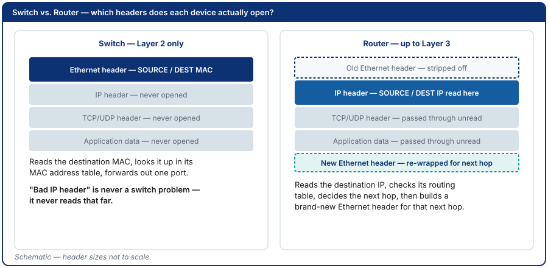
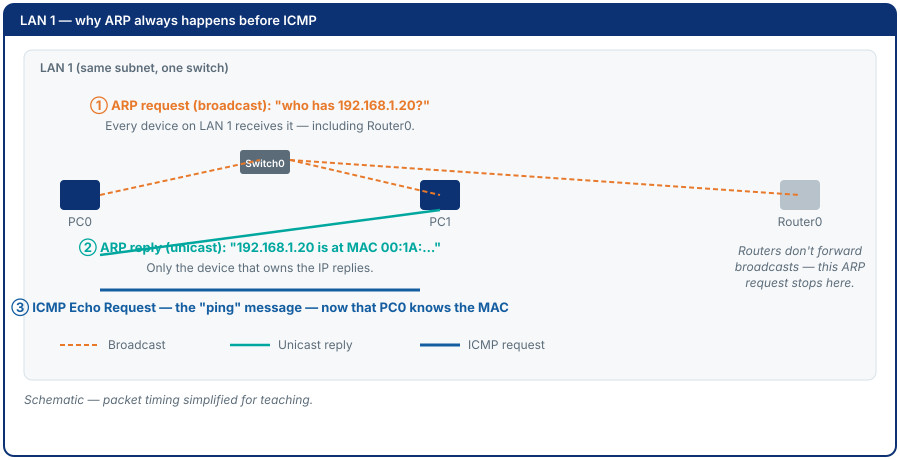
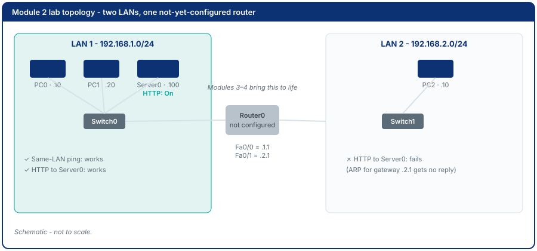

<!-- SLOT 1: Title -->
<!-- _class: title -->

# Module 2: Network Review 1 & Packet Tracer Intro

Intelligent Network Design (지능형네트워크설계)

Amalia · 컴퓨터응용수학부 소프트웨어융합전공 · 한경국립대학교

---

<!-- SLOT 2: Where we are -->

# Where We Are

Wk 1

Orientation

Wk 2

Network Review 1

Wk 3

Basic Config

Wk 4

IOS Management

Wk 5

Static Routing

Wk 6

Dynamic Routing

Wk 7

ACLs

Wk 8

Midterm Exam

Wk 9

VLANs

Wk 10

WAN: PPP &amp; NAT

Wk 11

OSPF

Wk 12

DHCP

Wk 13

Proposal Presentation

Wk 14

Results Presentation

Wk 15

Final Exam

Abbreviated topic names on this map (ACLs, VLANs, WAN, PPP, NAT, OSPF, DHCP) are each spelled out in full in their own module.

---

<!-- SLOT 3+4: Recap and the pain -->
<!-- _class: callout -->

# "The Network Is Down" - But Where?

Last time: you built a small network and proved two machines could talk. What you still can't do: say *where* it broke when it stops working.

A junior engineer says "the network is down." Usually it means one
application on one machine stopped working. Is the cable unplugged? Is the
address wrong? Is the port blocked? Is the server itself down? Without a
systematic way to check, "down" is just a guess.

---

<!-- SLOT 5: Cost of not knowing -->
<!-- _class: callout -->

# What This Actually Costs

- Without a layer-by-layer checklist, troubleshooting becomes random guessing
- Wrong fixes get applied at the wrong layer, wasting time without resolving anything

<strong>In industry:</strong> "which layer would you check first" is one of the most common networking interview questions - it tests whether you troubleshoot systematically or guess.

---

<!-- SLOT 6: Driving question -->
<!-- _class: section -->

# This Module's Question

"When someone says 'the network is down,' which layer do you check first?"

---

<!-- SLOT 7: Learning outcomes -->

# By the End of This Module, You Can

1. Describe each layer of the **OSI model** (Open Systems Interconnection) and map it to the **TCP/IP model** (Transmission Control Protocol / Internet Protocol)
2. Use Packet Tracer's Simulation Mode to watch data gain and lose its per-layer wrapping - **encapsulation** and **decapsulation**
3. Identify which protocols operate at which layers from a packet capture
4. Trace a full **HTTP** (HyperText Transfer Protocol - the web's request language) page load, naming each envelope added and removed

---

<!-- SLOT 8: Origin -->

# Where This Idea Came From

The **OSI model** (**ISO** - International Organization for Standardization,
1984) was designed by committee to let any vendor's equipment interoperate -
a teaching and interoperability reference, mostly never implemented
layer-for-layer. The **TCP/IP model** (Vint Cerf & Bob Kahn, 1974, funded by
**DARPA** - the U.S. Defense Advanced Research Projects Agency) was the
pragmatic, already-shipping protocol suite that became the real internet.
Today we use OSI's vocabulary to talk about TCP/IP's reality.

---

<!-- SLOT 9: Core concept -->

# Encapsulation: Definition

> Each layer adds a **header** (and sometimes a trailer) to the data handed
> down from above - **encapsulation**. At the receiving end, each layer
> strips its own header and passes the remainder up - **decapsulation**.
> Each wrapped stage has its own name - its **PDU** (Protocol Data Unit).

---

# Encapsulation, Visualized

---

# The Layer Map

| OSI | TCP/IP | PDU | Key Protocols |
|-----|--------|-----|---------------|
| Application / Presentation / Session | Application | Data | HTTP, DNS |
| Transport | Transport | Segment | TCP, UDP |
| Network | Internet | Packet | IP, ICMP, ARP |
| Data Link / Physical | Network Access | Frame / Bit | Ethernet |

Full name for every protocol here: next slide.

---

# The Protocols You'll Meet Today

**HTTP** = HyperText Transfer Protocol - how browsers request pages
**DNS** = Domain Name System - turns names into IP addresses
**TCP** = Transmission Control Protocol - reliable, connection-based delivery
**UDP** = User Datagram Protocol - fast, connectionless delivery

**IP** = Internet Protocol - addressing between networks
**ICMP** = Internet Control Message Protocol - the messages behind `ping`
**ARP** = Address Resolution Protocol - finds the MAC for a known IP
**MAC address** = Media Access Control - the interface's hardware address

---

<!-- Act 3 / BUILD -->

# Switch vs Router - Which Layer Do They Read?

- **Switch (Layer 2):** reads the destination MAC, never opens the IP header
- **Router (Layer 3):** reads the destination IP, re-wraps for the next hop

---

# Why ARP Must Precede ICMP

ARP resolves a MAC address before ICMP can be sent - and it cannot cross a
router. Follow the three numbered steps below.

---

<!-- SLOT N-2: Worked example -->

# Guided Lab at a Glance

**Part A** - build a two-LAN review topology (same-subnet pings work;
cross-router pings intentionally fail - the router comes alive in Modules 3-4)

**Part B** - Simulation Mode: watch ARP + ICMP for a same-subnet ping

**Part C** - Simulation Mode: trace a full HTTP page load to a server on
your own LAN - ARP, then TCP, then HTTP - then watch the same request die
at the unconfigured router

**Part D** - ARP cause-and-effect: why `arp -a` output changes after a ping

---

# Module 2 Lab Topology

---

<!-- SLOT N-1: Common mistakes -->

# Common Mistakes

- **Assuming a switch reads IP headers:** it doesn't - a switch never looks
  past Layer 2, so "the switch dropped it because of a bad IP" is never the
  right diagnosis
- **Testing HTTP before checking ARP/ICMP:** if the lower layers aren't
  confirmed working first, a failed HTTP request tells you nothing about
  *where* the problem is

---

<!-- SLOT N: Check yourself -->

# Check Yourself

1. What is encapsulation? Describe it in one sentence without using the word "wrap."
2. A frame is received by a switch. Does the switch look at the IP header? Why or why not?

---

# Answers

1. Each layer adds its own header to the data before passing it down to the layer below
2. No - a switch operates at Layer 2 and only reads the destination MAC address to decide which port to forward the frame out of

---

<!-- SLOT N+1+N+2: Limits and bridge -->
<!-- _class: callout -->

# What Layer-by-Layer Tracing Cannot Do

You can now trace a packet through every layer. But the router in your
topology has no hostname, no password, nothing configured - anyone with
access to it could type <code>enable</code> and change anything.

Next: Module 3 secures the router - navigating **IOS** (Cisco's Internetwork Operating System) - and Module 4 brings its interfaces to life.

---

<!-- SLOT N+3: Summary -->

# Summary

- **The answer:** layer by layer, bottom-up, systematically - never guess
- **Encapsulation & decapsulation:** wrap going down, unwrap coming back up
- **Switch vs router:** switch reads only the MAC; router reads the IP and re-wraps
- **ARP before ICMP:** resolves MAC by broadcast - broadcasts don't cross a router
- **HTTP trace:** ARP, then a TCP handshake, then the HTTP request/response
- **Deliverables & assessment:** topology diagram, ARP/ICMP + HTTP screenshots,
  switch-vs-router write-up - full rubric in the book

---

<!-- SLOT N+4: Thank You -->
<!-- _class: end -->

# Thank You

Full step-by-step lab instructions: 
<a href="../book/module-02.html">Open Module 2 in the Book</a>

