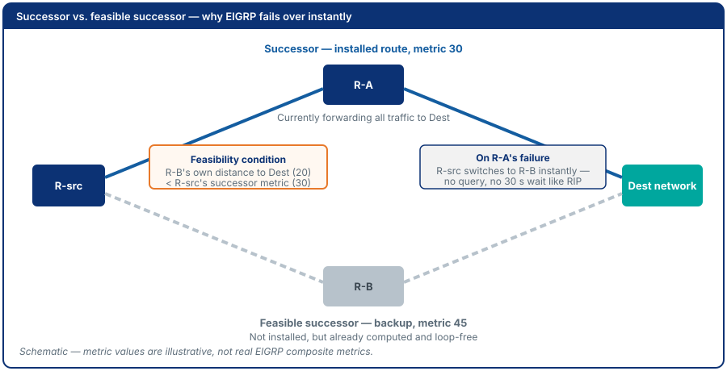
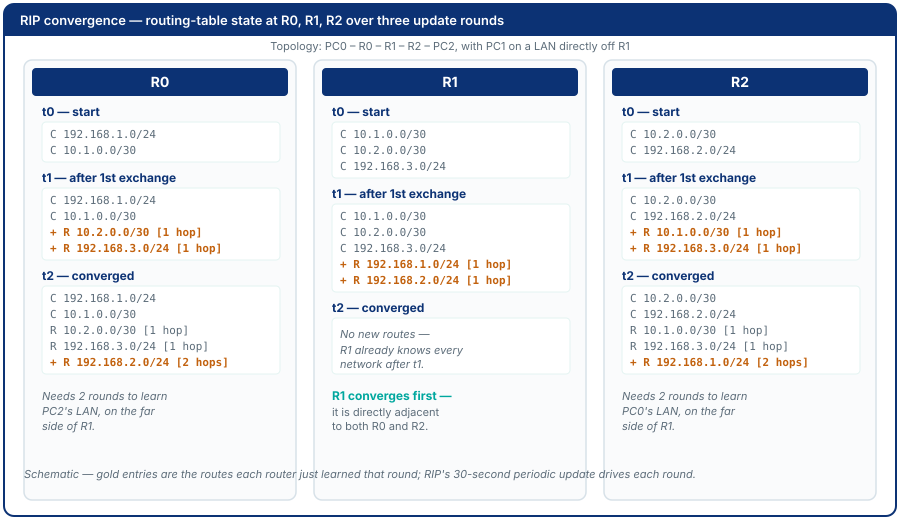

<!-- SLOT 1: Title -->
<!-- _class: title -->

# Module 6: Dynamic Routing - RIP & EIGRP

<span class="subtitle">Intelligent Network Design (지능형네트워크설계)</span>

<div class="meta">
Amalia · 컴퓨터응용수학부 소프트웨어융합전공 · 한경국립대학교
</div>

---

<!-- SLOT 2: Where we are -->

# Where We Are

<div class="roadmap">
<div class="wk"><div class="n">Wk 1</div><div class="t">Orientation</div></div>
<div class="wk"><div class="n">Wk 2</div><div class="t">Network Review 1</div></div>
<div class="wk"><div class="n">Wk 3</div><div class="t">Basic Config</div></div>
<div class="wk"><div class="n">Wk 4</div><div class="t">IOS Management</div></div>
<div class="wk"><div class="n">Wk 5</div><div class="t">Static Routing</div></div>
<div class="wk now"><div class="n">Wk 6</div><div class="t">Dynamic Routing</div></div>
<div class="wk"><div class="n">Wk 7</div><div class="t">ACLs</div></div>
<div class="wk review"><div class="n">Wk 8</div><div class="t">Midterm Exam</div></div>
<div class="wk"><div class="n">Wk 9</div><div class="t">VLANs</div></div>
<div class="wk"><div class="n">Wk 10</div><div class="t">WAN: PPP &amp; NAT</div></div>
<div class="wk"><div class="n">Wk 11</div><div class="t">OSPF</div></div>
<div class="wk"><div class="n">Wk 12</div><div class="t">DHCP</div></div>
<div class="wk review"><div class="n">Wk 13</div><div class="t">Proposal Presentation</div></div>
<div class="wk review"><div class="n">Wk 14</div><div class="t">Results Presentation</div></div>
<div class="wk review"><div class="n">Wk 15</div><div class="t">Final Exam</div></div>
</div>

---

<!-- SLOT 3+4: Recap and the pain -->
<!-- _class: callout -->

# One Misconfiguration, Global Outage

<span class="thread">Last time: a link failure at 3 AM still requires a human to log in and fix every affected router by hand.</span>

<div class="pain">

A university campus has 40 buildings; a national ISP has hundreds of
routers. If a link goes down at 3 AM, someone must log into each affected
router and manually update routes - or the affected sites stay isolated
until morning. In 2021, a single routing misconfiguration took down
Instagram, WhatsApp, and Oculus worldwide for six hours.

</div>

---

<!-- SLOT 5: Cost of not knowing -->
<!-- _class: callout -->

# What This Actually Costs

- Manual route maintenance doesn't scale past a handful of sites
- A single bad update can propagate and remove reachability everywhere at once

<div class="why">
<strong>In industry:</strong> understanding how dynamic routing propagates and fails is what separates "the internet went down" postmortems that get fixed in minutes from ones that take hours.
</div>

---

<!-- SLOT 6: Driving question -->
<!-- _class: section -->

# This Module's Question

<div class="driving-q">"How does a network route around a failure without a human logging in first?"</div>

---

<!-- SLOT 7: Learning outcomes -->

# By the End of This Module, You Can

1. Explain the difference between distance-vector and link-state routing
2. Configure RIPv2 on multiple routers and verify route propagation
3. Configure EIGRP and compare its convergence speed to RIP
4. Verify with `show ip protocols`, `show ip rip database`, `show ip eigrp neighbors`, and read each route's AD and metric
5. Simulate a link failure in a redundant network and observe reconvergence

---

<!-- SLOT 8: Origin -->

# Where This Idea Came From

RIP traces back to Xerox PARC's routing work in the late 1970s, formalized
as an internet standard in **RFC 1058 (1988)** - simple, but limited to 15
hops by design, to prevent routing loops from running forever. **EIGRP**
(Cisco, 1994) built on distance-vector research from SRI International's
DUAL algorithm to converge far faster while staying easy to configure.

---

<!-- SLOT 9: Core concept -->

# Distance-Vector Routing: Definition

> A **distance-vector** protocol shares its own routing table with directly
> connected neighbors, who add their own cost and pass it on - routers
> learn the network gradually, hop by hop, without ever seeing the full
> topology.

A **link-state** protocol instead floods each router's own links to everyone,
so every router builds the same full map and computes paths itself.

| Property | RIP | EIGRP | Link-state (OSPF) |
|----------|-----|-------|------|
| Shares | Routes, by rumor | Routes, by rumor | Own links, to all |
| Metric | Hop count | Composite (BW, delay) | Cost |
| Updates | Periodic, 30s | Triggered + hellos | Triggered |
| Convergence | Slow | Fast | Fast |

*OSPF is Module 11.*

---

<!-- Act 3 / BUILD -->

# Administrative Distance and Reading a Route

When two sources offer the same network, the lowest **administrative distance (AD)** wins, before any metric is compared.

| Connected | Static | EIGRP | OSPF | RIP |
|-----------|--------|-------|------|-----|
| 0 | 1 | 90 | 110 | 120 |

```
R  192.168.3.0/24 [120/1] via 10.0.1.2
D  192.168.3.0/24 [90/3072] via 10.0.1.2
```

`[AD/metric]`: RIP is `[120/1]` (1 hop); EIGRP is `[90/3072]`.

---

# Configuration Patterns

**RIPv2** (classful network statements):
```
router rip
 version 2
 network <classful-network>
 no auto-summary
```

**EIGRP** (wildcard mask, AS number must match on all routers):
```
router eigrp <AS-number>
 network <network> <wildcard-mask>
 no auto-summary
```

---

# Why EIGRP Converges Faster

EIGRP's **DUAL algorithm** pre-computes **feasible successors** - loop-free
backup routes ready before a failure. RIP notices a silent failure only after
180 s of missed updates; EIGRP after about 15 s of missed hellos.



---

# RIP: One Round to Learn, Minutes to Notice a Silent Failure



---

# Verifying Dynamic Routing

| Command | What it shows |
|---------|---------------|
| `show ip route` | Installed routes with `[AD/metric]`, next hop, age |
| `show ip protocols` | Which protocol runs, networks, timers, sources, AD |
| `show ip rip database` | Every RIP route: connected or learned via a neighbor |
| `show ip eigrp neighbors` | Adjacent routers, hold timer, uptime |

---

<!-- SLOT N-2: Worked example -->

# Guided Lab at a Glance


**A:** RIPv2. **B:** break the R0-R1 path, watch RIP. **C:** EIGRP, same failure.

---

<!-- SLOT N-1: Common mistakes -->

# Common Mistakes

- **Forgetting `no auto-summary`:** without it, RIP/EIGRP summarize at
  classful boundaries, breaking routing across discontiguous subnets
- **Copying one router's `network` lines to the others:** each router
  must advertise its own networks, not R0's
- **Mismatched EIGRP AS numbers:** routers with different AS numbers never
  form a neighbor relationship - no error, just silence

---

<!-- SLOT N: Check yourself -->

# Check Yourself

1. What metric does RIP use to determine the best path? What metric does EIGRP use?
2. What is "convergence" in a dynamic routing context?
3. A router learns the same network from RIP and from EIGRP. Which route is installed, and why?

---

# Answers

1. RIP uses hop count; EIGRP uses a composite metric based on bandwidth, delay, and reliability
2. The process by which all routers in a network reach a consistent, up-to-date view of reachable routes after a topology change
3. The EIGRP route: its AD (90) is lower than RIP's (120), and AD is compared before the metric

---

<!-- SLOT N+1+N+2: Limits and bridge -->
<!-- _class: callout -->

# What Dynamic Routing Cannot Do

<div class="limits">
RIP and EIGRP now find alternate paths automatically when a link fails.
But nothing here stops an unauthorized source from reaching a vulnerable
service in the first place - routing gets a packet somewhere; it doesn't
ask whether it should.
</div>

<span class="thread">Next: Module 7 addresses traffic filtering - Access Control Lists.</span>

---

<!-- SLOT N+3: Summary -->

# Summary

- Dynamic routing automates what static routing did by hand
- EIGRP's pre-computed backups converge faster than RIP's wait-and-detect
- **Deliverables & assessment:** routing tables for both protocols, link
  failure convergence comparison - see the book for the full rubric

---

<!-- SLOT N+4: Thank You -->
<!-- _class: end -->

# Thank You

<div class="meta">
Full step-by-step lab instructions:<br>
<a href="../book/module-06.html">Open Module 6 in the Book</a>
</div>
