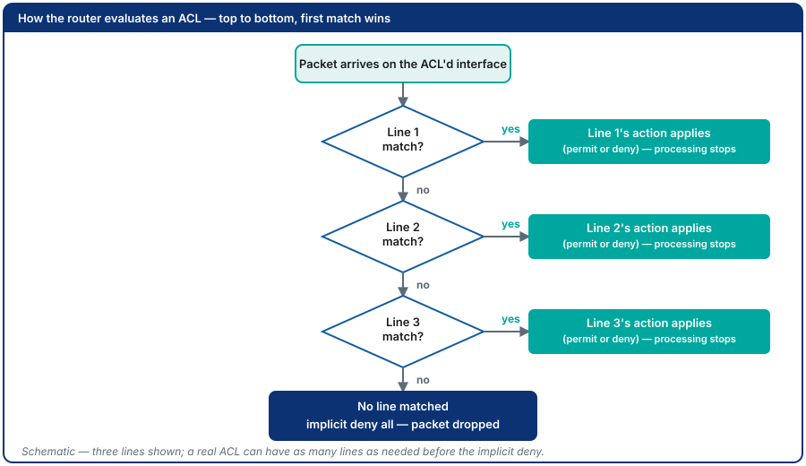
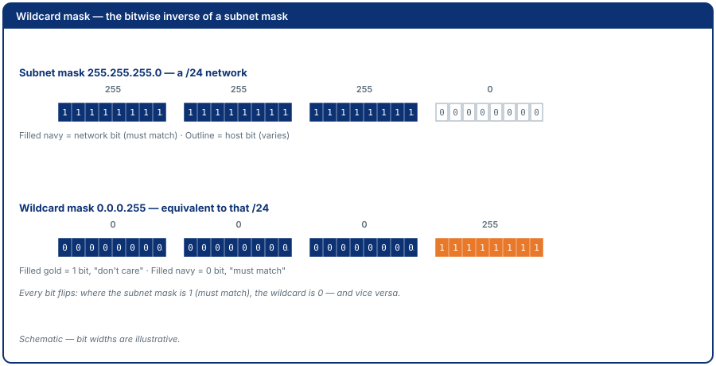
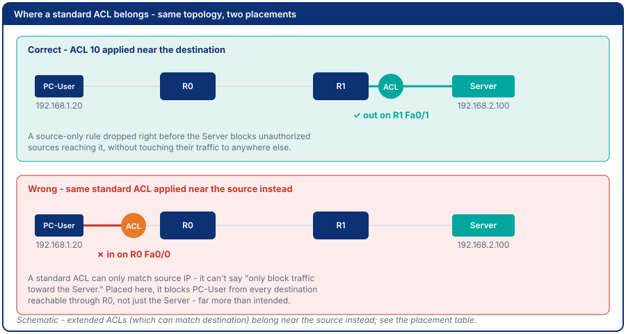
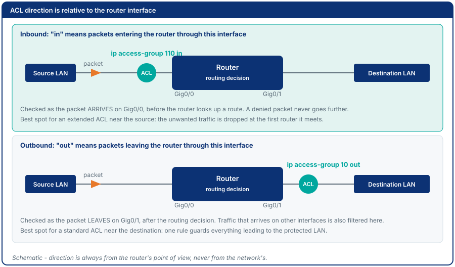

<!-- SLOT 1: Title -->
<!-- _class: title -->

# Module 7: Access Control Lists

<span class="subtitle">Intelligent Network Design (지능형네트워크설계)</span>

<div class="meta">
Amalia · 컴퓨터응용수학부 소프트웨어융합전공 · 한경국립대학교
</div>

---

<!-- SLOT 2: Where we are -->

# Where We Are

<div class="roadmap">
<div class="wk"><div class="n">Wk 1</div><div class="t">Orientation</div></div>
<div class="wk"><div class="n">Wk 2</div><div class="t">Network Review 1</div></div>
<div class="wk"><div class="n">Wk 3</div><div class="t">Basic Config</div></div>
<div class="wk"><div class="n">Wk 4</div><div class="t">IOS Management</div></div>
<div class="wk"><div class="n">Wk 5</div><div class="t">Static Routing</div></div>
<div class="wk"><div class="n">Wk 6</div><div class="t">Dynamic Routing</div></div>
<div class="wk now"><div class="n">Wk 7</div><div class="t">ACLs</div></div>
<div class="wk review"><div class="n">Wk 8</div><div class="t">Midterm Exam</div></div>
<div class="wk"><div class="n">Wk 9</div><div class="t">VLANs</div></div>
<div class="wk"><div class="n">Wk 10</div><div class="t">WAN: PPP &amp; NAT</div></div>
<div class="wk"><div class="n">Wk 11</div><div class="t">OSPF</div></div>
<div class="wk"><div class="n">Wk 12</div><div class="t">DHCP</div></div>
<div class="wk review"><div class="n">Wk 13</div><div class="t">Proposal Presentation</div></div>
<div class="wk review"><div class="n">Wk 14</div><div class="t">Results Presentation</div></div>
<div class="wk review"><div class="n">Wk 15</div><div class="t">Final Exam</div></div>
</div>

---

<!-- SLOT 3+4: Recap and the pain -->
<!-- _class: callout -->

# One Open Port, One Death

<span class="thread">Last time: nothing stops an unauthorized source from reaching a vulnerable service in the first place.</span>

<div class="pain">

In 2020, a ransomware attack on a hospital forced the redirect of
emergency patients - one patient died during the delay. Attackers entered
through a remote-access server with no traffic restrictions: any address
could connect and exploit it. Routing got them there; nothing stopped them.

</div>

---

<!-- SLOT 5: Cost of not knowing -->
<!-- _class: callout -->

# What This Actually Costs

- Without traffic filtering, "reachable" and "authorized" mean the same thing - which they should never mean
- One exposed service becomes the entry point for an entire network compromise

<div class="why">
<strong>In industry:</strong> ACLs are the most widely deployed traffic-filtering tool in the world - in every corporate router, every ISP core, every campus network.
</div>

---

<!-- SLOT 6: Driving question -->
<!-- _class: section -->

# This Module's Question

<div class="driving-q">"How do you let the traffic you want through, and nothing else?"</div>

---

<!-- SLOT 7: Learning outcomes -->

# By the End of This Module, You Can

1. Explain standard vs extended ACLs, when to use each
2. Write numbered and named ACL rules with wildcard masks
3. Apply an ACL to the correct interface and direction
4. Verify with `show access-lists` and `show ip interface`
5. Debug a misconfigured ACL by reading hit counts

---

<!-- SLOT 8: Origin -->

# Where This Idea Came From

Access control lists originate from Unix file-permission concepts of the
1970s, adapted by router vendors in the late 1980s into packet filtering -
years before dedicated firewall appliances existed. For most of networking
history, the router's ACL *was* the firewall.

---

<!-- SLOT 9: Core concept -->

# ACL Processing: Definition

> Rules are evaluated **top to bottom**; the first match wins. If no rule
> matches: **implicit deny all**. A **standard** ACL matches source IP
> only; an **extended** ACL matches source, destination, protocol, and
> port.

| Property | Standard | Extended |
|----------|----------|----------|
| Matches on | Source IP only | Source, Dest, Protocol, Port |
| Numbered range | 1-99 | 100-199 |
| Best placed | Close to **destination** | Close to **source** |

---

<!-- Act 3 / BUILD -->

# How the Router Checks an ACL

Every ACL is a numbered list of rules, checked top to bottom against the
packet. The very first line that matches decides the packet's fate -
every rule after it is never even looked at.



---

# Wildcard Masks

| Wildcard | Matches |
|----------|---------|
| `0.0.0.0` | Exactly one host (`host` keyword) |
| `0.0.0.255` | All hosts in a /24 |
| `255.255.255.255` | All addresses (`any` keyword) |

A wildcard `1` bit means "don't care" - the inverse of a subnet mask.



---

# Where to Place Standard vs. Extended ACLs

A standard ACL only sees source IP - it cannot tell one destination from
another. Placed too early, it blocks a source from everything beyond that
point, not just the one destination it was meant to protect.



---

# Direction: In or Out, Relative to the Router

`ip access-group <n|name> in|out` binds an ACL to **one interface in one direction**. `in` filters packets as they arrive, before the routing decision; `out` filters them as they leave, after it.



---

# Writing the Rules: Syntax

```
access-list 110 deny tcp host 192.168.1.20 host 192.168.2.100 eq 80
access-list 110 permit ip any any

ip access-list extended BLOCK_WEB
 deny tcp host 192.168.1.20 host 192.168.2.100 eq www
 permit ip any any

interface GigabitEthernet0/0
 ip access-group BLOCK_WEB in
```

- Numbered ACLs are one global command per rule; **named** ACLs open a `(config-ext-nacl)#` mode where rules can be deleted by sequence number
- An ACL does nothing until it is bound with `ip access-group`

---

# Verifying: Match Counters and Bindings

```
R0# show access-lists
Extended IP access list BLOCK_WEB
    10 deny tcp host 192.168.1.20 host 192.168.2.100 eq www (8 match(es))
    20 permit ip any any (12 match(es))

R0# show ip interface GigabitEthernet0/0
  Outgoing access list is not set
  Inbound  access list is BLOCK_WEB
```

- `show access-lists`: which rule matched, and how often
- `show ip interface`: which ACL is bound, in which direction

---

# Worked Example: The Lab's Standard ACL

Applied outbound on R1's Server-facing interface, after PC `192.168.1.20` is flagged as compromised:

```
access-list 10 deny host 192.168.1.20
access-list 10 permit 192.168.1.0 0.0.0.255
access-list 10 deny any
```

| Source | Line that matches | Result |
|--------|-------------------|--------|
| `192.168.1.20` (flagged PC) | Line 1 | denied, Lines 2-3 never checked |
| `192.168.1.10` (admin PC) | Line 2 | permitted |
| `192.168.3.10` (remote LAN) | Line 3 | denied |

**Lab:** Part A is this ACL; Part B an extended ACL blocking HTTP from one host, inbound near the source; Part C rebuilds it as a named ACL and removes the final `permit` to expose the implicit deny.

---

<!-- SLOT N-1: Common mistakes -->

# Common Mistakes

- **Forgetting the final permit:** removing `permit ip any any` exposes the
  implicit deny, and all traffic crossing that interface and direction stops
- **Wrong direction or wrong router:** an ACL that exists but is not bound
  where the traffic passes filters nothing; check `show ip interface`
- **Placing an extended ACL far from the source:** it still works, but
  wastes bandwidth carrying traffic across the network only to drop it
  later

---

<!-- SLOT N: Check yourself -->

# Check Yourself

1. What wildcard mask matches *exactly one host*? What matches *all hosts*?
2. What happens to a packet that does not match any ACL entry?

---

# Answers

1. `0.0.0.0` (or the `host` keyword) matches one host; `255.255.255.255` (or `any`) matches all
2. It is dropped - the implicit deny all at the end of every ACL

---

<!-- SLOT N+1+N+2: Limits and bridge -->
<!-- _class: callout -->
<!-- Week 8 is the midterm - no deck, no chain link before Module 9 -->

# What ACLs Cannot Do

<div class="limits">
ACLs filter Layer 3 traffic between subnets. But they can't stop a
broadcast storm inside one flat Layer 2 network - an ACL never even sees
traffic that never needed to be routed in the first place.
</div>

<span class="thread">Next: Module 9 (after the Week 8 midterm) addresses Layer 2 broadcast isolation - VLANs.</span>

---

<!-- SLOT N+3: Summary -->

# Summary

- Filtering is not the same as routing: reachable does not mean authorized
- The implicit deny is the most common ACL authoring trap
- **Deliverables & assessment:** standard + extended + named ACL screenshots
  with hit counts, implicit-deny explanation - see the book for the full
  rubric

---

<!-- SLOT N+4: Thank You -->
<!-- _class: end -->

# Thank You

<div class="meta">
Full step-by-step lab instructions:<br>
<a href="../book/module-07.html">Open Module 7 in the Book</a>
</div>
